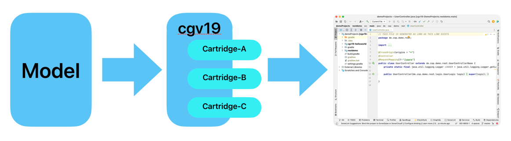
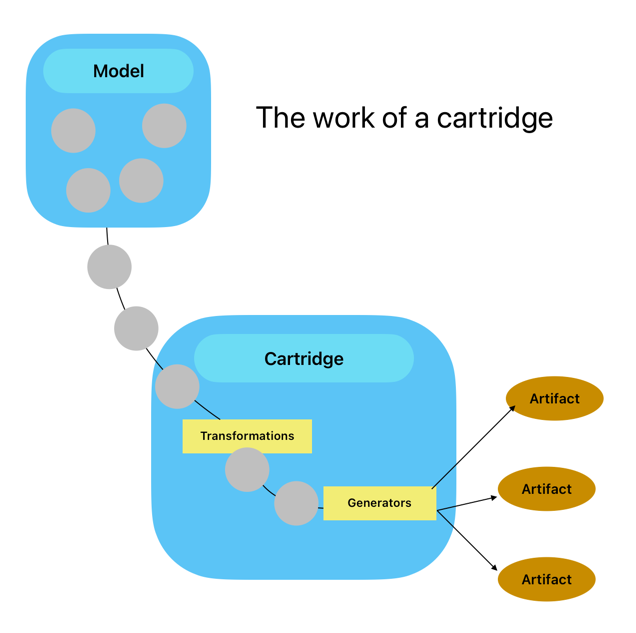

# Welcome to cgV19
Last Update on: June the 14th 2023
## Upcoming Release 23.1
__cgV19 Release 23.1 is in the pipeline. It will bring some exciting new features!__

New concept of CodeTargets, support for JavaPoet and more

## A code abstraction framework to
* Implement rules that make your ideas real code
* Automate boring coding tasks
* keep your documentation and Code in sync
* generate your own Code and use it where and when you want



### [Quick start: See doc/GettingStarted.md](docs/GettingStarted.md)

If you are looking for a Low Code platform development environment, you may consider trying
cgV19. With cgV19, you can build your own LowCode to NoCode development environment. It provides:

__Model-Driven development (MDD)__ 

With cgV19, your development will be driven by a Model described in some
Language or in UML.


The Model is a high-level abstraction, and with cgV19, you define the rules that bring this abstraction to life. In the demo project, you will find a project __restDemo__ that generates a complete
Spring Boot application from a Class marked as << Resource >>.

__Reusable__ 

With cgV19, you can build cartridges that can be used in many projects. Cartridges will interpret a Model and create the Code, the documentation, and all configuration that you may need.


A concrete project can plug in the cartridges that it will need.

The __restDemo__ project uses the __cgV19-RESTCartridge__ that generates a Spring Boot application and a runnable PHP Symfony application. The project can decide which backend to use. PHP/Symfony or Java/SpringBoot.

[__Groovy as a template language__](docs%2FGroovyAsTemplateLanguage.md)


A template
with Groovy can make use of its multiline strings with interpolation 
like this:

```groovy
MClass mClass = this.getProperty("modelElement");
OOModel model = mClass.getModel();


"""//${ProtectionStrategieDefaultImpl.GENERATED_LINE}
package ${mClass.getPackage().getFQName()};

public class ${mClass.getName()} {
}
"""
```


__Keep documentation and Code in sync__ 

With cgV19, you can build not only templates that are generated once and will act as a starting point for manual development. This is what tools like spring initializer or ng CLI-Platform do. cgV19 can generate Code that
is never touched and always generated to 100%. And the development cycle depends mainly on the Model. So for
many tasks, you need to update your Model, re-generate your Code and start developing. This ensures that your
Model and your program are always in sync; you can rely on the Model generated documentation.

__Deploy it where ever you want__ 

What you will generate is entirely in your hand. cgV19 is not a concrete
Low Code environment. It is a toolbox for building such environments. You can not only generate your Code. It is possible to create any artifact you need for your deployment. Dockerfiles, StartScripts, or even
generic user interfaces.

__cgV19 is tested with__ 

* Java 17
* Build with gradle 8

## What are all these modules?

### [core/cgV19-core](core/cgv19-core/doc/CoreArchitecture.md)

This is the core of cgV19. If you want to use cgV19, this is the module you 
must always use. All other modules depend on this.

### core/cgV19-oom

This module adds some primary object-oriented mode features to cgV19. It implements a model containing packages, classes, attributes, and relations between them. If you want to generate some object-oriented language like, let's say, java, you can use this module to read your Model into the generator.

### core/cgV19-gradle

This module implements a gradle plugin to enable gradle projects to use cgV19.

### core/cgV19-pojo

This is an example of a very basic __cartridge__. It can take an OOM-Model and will
generate PoJos on classes marked as PoJos in the Model.

Its main goal is to provide a simple example of a __cartridge__ and not to use it in a 
production environment.

### plugins/cgV19-VPPlugin

A plugin for [VisualParadigm](https://www.visual-paradigm.com) to provide the model in VP to 
cgV19 via port 7001. Only usable if you have VisualParadigm v17 or higher 
installed.

[VisualParadigm is available as a community edition](https://www.visual-paradigm.com/download/community.jsp). This edition comes with
no costs and is entirely sufficient for using cgV19 as your LowCode platform.

The Plugin is developed in a Model-driven environment and uses the
cgV19-VPPluginCartridge to generate the Code.

### plugins/cgV19-vpplugincartridge

This is the Cartridge used for building the VP-Plugin.

### plugins/cgV19-MDPlugin (deprecated)

The first version of cgV19 was used with MagicDraw as its modeling tool. 
But MagicDraw is now under the control of Dassault Systems, and the price is far beyond its original price.

It also has no community edition, so I switched to VP.


### [cartridges/cgV19-restcartridge](cartridges/cgv19-restcartridge/Readme.MD)

An (under construction) Cartridge that generates a complete runnable Spring Boot application from the Model. It also provides a PHP-Symfony Backend to demonstrate multiple language generation.

### [demoProjects/restDemo](demoProjects/restdemo/Readme.md)

A demonstration project of how to use the cgV19-RESTCartridge.

### demoProjects/cgV19-helloWorld

This a very, very basic project to demonstrate how you can use cgV19 in your projects.
The truth of how to use cgV19 is here!

## Want to start?

If you want to have a brief "how does it feel" follow the steps in the [Getting Started](docs/GettingStarted.md). 

But be warned: Model-driven development is powerful and fun. But you should know that writing templates and transformations for a productive application is as complex as writing a compiler. And also as powerful. The actual use of MDD comes with powerful transformations and code generators that implement a high level of abstraction. For example, with a simple class marked as __Ressource__, you can generate a whole Spring Boot 2 Resource (Entity, Repository, Controller) with Angular frontend (TypeScript: Model, Service, Form). Where everything fits, changes will synchronize frontend and backend, and manually written Code is not 
affected. But from scratch to that is a long way to go.


# How does it work


cgV19 uses the Java service loader mechanism to find its components. The first component is an implementation of the ModelLoader interface. 

One implementation is located in the cgV19-oom jar and can handle oom-Files with the syntax seen in the helloWorld.oom. 

## ModelLoader

A ModelLoader takes a String that describes the input of a (text) source and will create an instance of _Model_. The string could be a path to a file or a URL. cgV19 comes with a ModelLoader that can take text files in the OOM Format or a URL to a REST Service that provides an OOM-File.

The ModelLoader is called to create a new instance every time a cartridge is 
started. It should not buffer Model instances because this can lead to unpredictable 
side effects.

## Cartridges



[You can find a detailed description of a cartridge here](cartridges/doc/Cartridges.md)

Cartridges provide the actual generation logic to a project. In a real project, you can have several cartridges working on the same input model. One Cartridge could generate the JPA-Classes and repositories. A second cartridge can generate the controller layer with REST-Classes. A third cartridge could provide TypeScript code for Angular services that can call the Java controller. Cartridges are part 
of your project and need to be maintained by the developer team.

Cartridges take a model and will perform several _Transformations_ on it. These 
Transformations will enhance the input model with more Classes, Stereotypes, 
Attributes, Relations, and more.

After that, the Cartridge will be called to do the generation tasks. It interprets the Model and defines what to do with the declared model elements. That means that a cartridge defines your own DSL of your project.

### cgV19-pojo
A very simple cartridge is in the cgV19-pojo module. This Cartridge is for learning
how to write a cartridge or as a base for your own.

###cgV19-RESTCartridge

The module cgV19-RESTCartridge is a much more complex cartridge that
will generate a whole Spring Boot application from a simple << Resource >> 
class. It also generates a type-script model and a PHP-Symfony backend
that does the same as the Spring Boot application. 

The purpose of this Cartridge is to show the power of MDD and to
check the concepts behind cgV19.

You can use these cartridges as they are or copy and modify them for
your own needs,

## [A brief history](docs/aBriefHistory.md)
