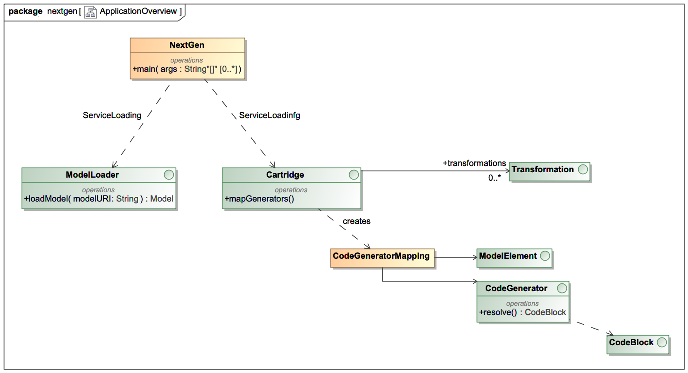

# Tutorial to cgV19
_Last Update on: March the 17th 2022._

This is the core of the NextGen V19

## A brief history
In 2002 i started to work on a project for an insurance company in germany. The goal was to build 
an application for insurance estimations. The problem was it has to run in multiple channels
on the web or as a pure swing application. And in 2002 this was a real task.

We decided to work with a self programmed code generator called __CodeGen__. This generator
has gone several realeases and is still in work for the project.

In 2019 i started to recreate the whole generator from scratch. This is the
begining of __cgV19__

In __cgV19__ i implemented several features i missed in CodeGen. It has a new
concept of so called __cartridges__. Yes think of it as the old hardware
modules to plug into your game console. It has a self generated
meta model and the loading of a model can be plugged in from 
classpath.

Dependencies are very low. The core module only depends on Groovy.
Groovy is a language on top of java that is predestined for generation
and defining DSLs. 

While the old CodeGen had a very special model type (xml), __cgV19__ 
has a java meta model, that can be extended and created from nearly
every type of data.

__cgV19__ comes with a plugin for gradle. You can add it to your build.gradle and
the generator will run before the compile task starts. 

## What are all these modules?

### [core/cgV19-core](core/cgV19-core/doc/CoreArchitecture.md)

This is the very hard of cgV19. If you want to use cgV19, this is the module you 
really allways have to use. All other modules dependending on this.

### core/cgV19-oom

This modules adds some basic object oriented mode features to cgV19. It impelements
a model that containes packages, classes, attribute and relations between the
classes. If you want to generate some object oriented language like, let's say java,
you can use this module to read your model into the generator.

### core/cgV19-pojo

This is an example of a very basic __cartridge__. It can take a OOM-Model and will
generate PoJos on classes marked as PoJos in the model.

### core/cgV19-gradle

This module implements a gradle plugin to enable gradle projects to use cgV19.

### core/cgV19-MDPlugin

A plugin for MagicDraw to provide the model in MagicDraw to 
cgV19 via port 7000. Only useable if you have MagicDraw v18.5 or higher 
installed.

### [cartridges/cgV19-RESTCartridge](cartridges/cgV19-RESTCartridge/Readme.md)

A (under construction) cartridge that generates a full runnable Spring Boot
application from the a model. It also provides a PHP-Symfony Backend to
demonstrate multiple language generation.

### [demoProjects/restDemo](demoProjects/restDemo/Readme.md)

A demonstration project of how to use the cgV19-RESTCartridge.

### demoProjects/cgV19-helloWorld

A very very basic project to demonstrate how you can use cgV19 in your projects.
The truth of how to use cgV19 is here!

## Want to start?

If you want to have a brief "how does it feel" follow the steps in th [Getting Started](doc/GettingStarted.md). 

But be warned: Model driven development is powerfull and fun. But you should know that 
writing templates and transformations for a real productive application is as
complex as writing a compiler. And also as powerfull. The real use of MDD comes
with powerfull transformations and generators that implementing a high level of 
abstraction. For example with a simple class marked as __Ressource__ you can
generate a whole Spring Boot 2 Resource (Entity, Repository, Controller) with
Angular frontend (TypeScript: Model, Service, Form). Where everything fits,
changes will synchronize frontend and backend and manual driven code is not 
affected. But from scratch to that is a long way to go.

# How does it work

cgV19 uses the java service loader mechanism to find it's components. The first
component is an implementation of the ModelLoader interface. 

One implementation is located in the cgV19-oom jar and in can handle oom-Files
with the syntax as seen in the helloWorld.oom. 

## ModelLoader

A ModelLoader takes a String, that describes the input of a (text) source and will
create a instance of _Model_. The string could be a path to a file ore an URL. cgV19
comes with a ModelLoader that can take text files in the OOM-Format or a URL to a 
REST-Service that provides a OOM-File.

The ModelLoader is called to create a new instance every time a cartridge is 
started. It should not buffer Model instances cause this can lead to unpredictable 
side effects.

## Cartridges

[You can find a detailed descritption of a cartidge here](cartridges/doc/Cartridges.md)

Cartridges provide the real generation logic to a project. In a real project you
can have several cartridges all working on the same input model. One Cartridge 
could generate the JPA-Classes and repositories. A second cartridge can generate 
the controller layer with REST-Classes. A third cartridge could provide TypeScript
code for Angular services that can call the Java controller. Cartridges are part 
of your project and need to be maintained by the developer team.

Cartridges take a model and will perform several _Transformations_ on it. These 
Transformations will enhance the input model with more Classes, Stereotypes, 
Attributes, Relations and more.

After that the cartridge will be called to do the generation tasks. It interprets
the model and so it defines what to do with the declared ModelElements.
That means that a cartridge defines your own DSL of your project.

### cgV19-pojo
A very simple cartrdige is in the cgV19-pojo module. This cartridge is for learning
howto write a cartridge or as a base for your own.

###cgV19-RESTCartridge

The module cgV19-RESTCartridge is a much more complex cartridge that
will generate a whole Spring Boot application from a simple << Resource >> 
class. It also generates a type-script model and a PHP-Symfony backend
that does the same as the Spring Boot application. 

The purpose of this cartridge is to show the power of MDD and to
check the concepts behind cgV19.

You can use this cartridges as they are or copy and modify them for
your own needs,
