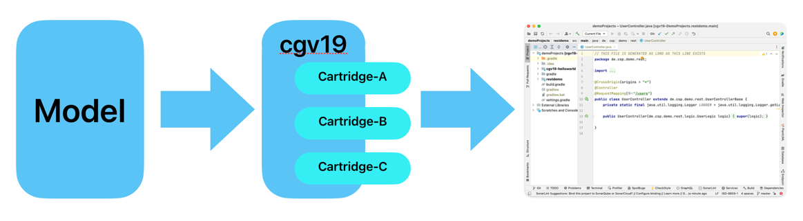
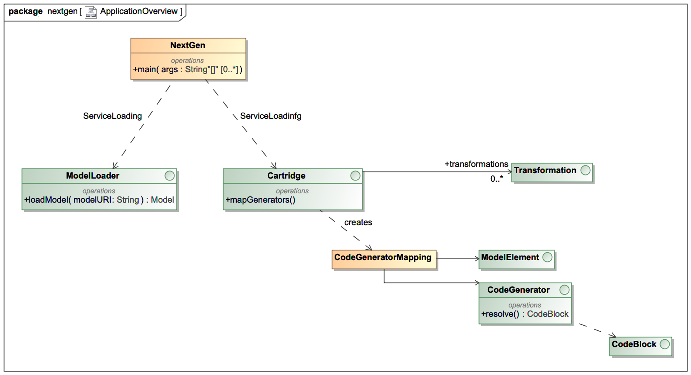
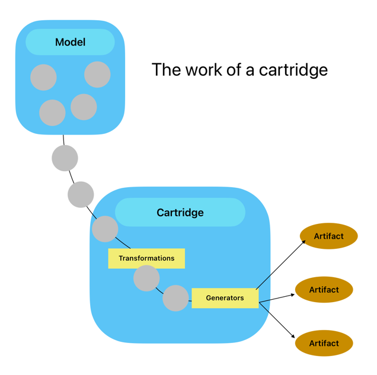

# Welcome to cgV19
Last Update on: Mai the 25th 2023

## A code abstraction framework to
* Implement rules that make your ideas real code
* Automate boring coding tasks
* keep your documentation and code in sync
* generate your own code and use it where and when you want

### [Quick start: See doc/GettingStarted.md](doc/GettingStarted.md)

If you are looking for a Low Code platform development environment you may consider trying
cgV19. With cgV19 you can build your own LowCode to NoCode development environment. It provides:

__Model driven development (MDD)__ 

With cgV19 your development will be driven from a Model described in some
Language or in UML. The model is a high level abstraction and with cgV19 you define the rules that brings
this abstraction to live. In the demoProjects you will find a project __restDemo__ that generates a complete
Spring Boot application from a single Class marked as << Resource >>.

__Reusable__ 

With cgV19 you can build cartridges that can be used in many projects. Cartridges
will interpret a Model and build the Code, the documentation and all configuration that you may need. A 
concrete project can plug in the cartridges that it will need.

The __restDemo__ project makes use of the __cgV19-RESTCartridge__ that generates a Spring Boot application as 
well as a runnable PHP Symfony application. The project can decide which backend to use. PHP/Symfony or 
Java/SpringBoot.

__Keep documentation and code in sync__ 

With cgV19 you can build not only templates that are generated once and will act as a start point for manual 
development. This is what tools like spring initializer or ng CLI-Platform do. cgV19 can generate code that
is never touched and always generated to 100%. And the development cycle depends mainly on the model. So for
many tasks you need to update your model, re-generate your code and start developing. This ensures, that your
model and you programm are always in sync, and you can rely on the model generated documentation.

__Deploy it where ever you want__ 

What you will generate is completely in your hand. cgV19 is not a concrete
Low Code environment. It is a tool box for building such environments. You can not only generate your code. 
It is possible to generate any artifact you need for your deployment. Dockerfiles, StartScripts or even
generic user interfaces.

__cgV19 is tested with__ 

* Java 17
* Build with gradle 8

## A brief history
In 2002, I started to work on a project for an insurance company in germany. The goal was to build 
an application for insurance estimations. The problem was it has to run in multiple channels
on the web or as a pure swing application. And in 2002 this was a real task.

We decided to work with a self programmed code generator called __CodeGen__. This generator
has gone several releases and is still in work for the project.

In 2019, I started to recreate the whole generator from scratch. This is the
beginning of __cgV19__

In __cgV19__ I implemented several features I missed in CodeGen. It has a new
concept of so-called __cartridges__. Yes think of it as the old hardware
modules to plug into your game console. It has a self generated
metamodel and the loading of a model can be plugged in from 
classpath.

Dependencies are very low. The core module only depends on Groovy.
Groovy is a language on top of java that is predestined for generation
and defining DSLs. 

While the old CodeGen had a very special model type (xml), __cgV19__ 
has a java metamodel, that can be extended and created from nearly
every type of data.

__cgV19__ comes with a plugin for gradle. You can add it to your build.gradle and
the generator will run before the compile task starts. 

It is not a big monolith but split in several modules. 

## What are all these modules?

### [core/cgV19-core](core/cgv19-core/doc/CoreArchitecture.md)

This is the very hard of cgV19. If you want to use cgV19, this is the module you 
really always have to use. All other modules depend on this.

### core/cgV19-oom

This module adds some basic object-oriented mode features to cgV19. It implements
a model that contains packages, classes, attribute and relations between the
classes. If you want to generate some object-oriented language like, let's say java,
you can use this module to read your model into the generator.

### core/cgV19-gradle

This module implements a gradle plugin to enable gradle projects to use cgV19.

### core/cgV19-pojo

This is an example of a very basic __cartridge__. It can take an OOM-Model and will
generate PoJos on classes marked as PoJos in the model.

Its main goal is to provide a simple example of a __cartridge__ and not to use it in a 
production environment.

### plugins/cgV19-VPPlugin

A plugin for [VisualParadigm](https://www.visual-paradigm.com) to provide the model in VP to 
cgV19 via port 7001. Only usable if you have VisualParadigm v17 or higher 
installed.

[VisualParadigm is available as a community edition](https://www.visual-paradigm.com/download/community.jsp). This edition comes with
no costs and is completely sufficient for using cgV19 as your LowCode platform.

The Plugin is developed in a model driven environment and uses the
cgV19-VPPluginCartridge to generate the code.

### plugins/cgV19-VPPluginCartridge

This is the cartridge used for building the VP-Plugin.

### plugins/cgV19-MDPlugin (deprecated)

The first version of cgV19 was used with MagicDraw as its modelling tool. 
But MagicDraw is now under the control of "Dassault Systems" and the price
is far beyond of its original price.

It also has no community edition, so I decided to switch to VP.

### [cartridges/cgV19-restcartridge](cartridges/cgv19-restcartridge/Readme.MD)

A (under construction) cartridge that generates a full runnable Spring Boot
application from the model. It also provides a PHP-Symfony Backend to
demonstrate multiple language generation.

### [demoProjects/restDemo](demoProjects/restdemo/Readme.md)

A demonstration project of how to use the cgV19-RESTCartridge.

### demoProjects/cgV19-helloWorld

A very, very basic project to demonstrate how you can use cgV19 in your projects.
The truth of how to use cgV19 is here!

## Want to start?

If you want to have a brief "how does it feel" follow the steps in th [Getting Started](doc/GettingStarted.md). 

But be warned: Model driven development is powerful and fun. But you should know that 
writing templates and transformations for a real productive application is as
complex as writing a compiler. And also as powerful. The real use of MDD comes
with powerful transformations and generators that implementing a high level of 
abstraction. For example with a simple class marked as __Ressource__ you can
generate a whole Spring Boot 2 Resource (Entity, Repository, Controller) with
Angular frontend (TypeScript: Model, Service, Form). Where everything fits,
changes will synchronize frontend and backend and manual driven code is not 
affected. But from scratch to that is a long way to go.

# How does it work

cgV19 uses the java service loader mechanism to find its components. The first
component is an implementation of the ModelLoader interface. 

One implementation is located in the cgV19-oom jar and in can handle oom-Files
with the syntax as seen in the helloWorld.oom. 

## ModelLoader

A ModelLoader takes a String, that describes the input of a (text) source and will
create an instance of _Model_. The string could be a path to a file ore a URL. cgV19
comes with a ModelLoader that can take text files in the OOM-Format or a URL to a 
REST-Service that provides an OOM-File.

The ModelLoader is called to create a new instance every time a cartridge is 
started. It should not buffer Model instances because this can lead to unpredictable 
side effects.

## Cartridges

[You can find a detailed description of a cartridge here](cartridges/doc/Cartridges.md)

Cartridges provide the real generation logic to a project. In a real project you
can have several cartridges all working on the same input model. One Cartridge 
could generate the JPA-Classes and repositories. A second cartridge can generate 
the controller layer with REST-Classes. A third cartridge could provide TypeScript
code for Angular services that can call the Java controller. Cartridges are part 
of your project and need to be maintained by the developer team.

Cartridges take a model and will perform several _Transformations_ on it. These 
Transformations will enhance the input model with more Classes, Stereotypes, 
Attributes, Relations and more.

After that the cartridge will be called to do the generation tasks. It interprets
the model and so it defines what to do with the declared ModelElements.
That means that a cartridge defines your own DSL of your project.

### cgV19-pojo
A very simple cartridge is in the cgV19-pojo module. This cartridge is for learning
howto write a cartridge or as a base for your own.

###cgV19-RESTCartridge

The module cgV19-RESTCartridge is a much more complex cartridge that
will generate a whole Spring Boot application from a simple << Resource >> 
class. It also generates a type-script model and a PHP-Symfony backend
that does the same as the Spring Boot application. 

The purpose of this cartridge is to show the power of MDD and to
check the concepts behind cgV19.

You can use these cartridges as they are or copy and modify them for
your own needs,
