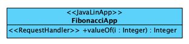

# [cgv19 JavaLin Cartridge](https://javalin.io/)


This cartridge is intended to implement small but time-consuming services that needs to be horizontaly scaled. JavaLin
has a very small footprint and so there could be many of this
nodes running in a cluster. 

To implement a JavaLin application with the use of this
cartridge you need to add a MClass with stereotype 
<< JavalinApp >> in the root package of your model.

For each Endpoint you can define a << RequestHandler >> method
and specifiy the Request-Path and -Method on the stereotype.

Here a small example:



The cartridge will generate the following output:

```logs
.
├── Dockerfile
├── build.gradle
└── src
    └── main
        ├── java
        │   └── de
        │       └── spraener
        │           └── tinyapp
        │               └── fibonacci
        │                   └── ValueOfHandler.java
        └── java-gen
            └── de
                └── spraener
                    └── tinyapp
                        └── fibonacci
                            ├── FibonacciApp.java
                            └── ValueOfHandlerBase.java

```

The business logic needs to be implemented in the *Handler-Class. You can start the application with

```bash
gradle run
```

The applicaiton will listen on port 7070 by default.

To build the docker file run a 

```build
docker build -t <TagNam> .
```

and then a

```bash
docker run -p 7070:7070 <TagName>
```
