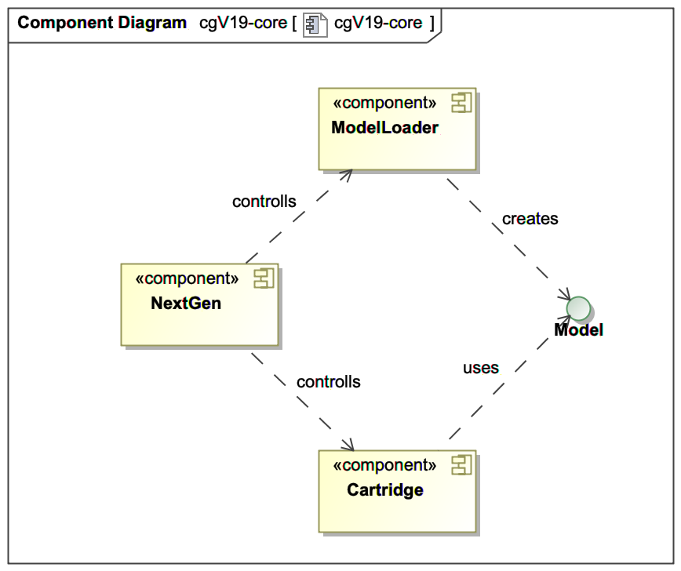
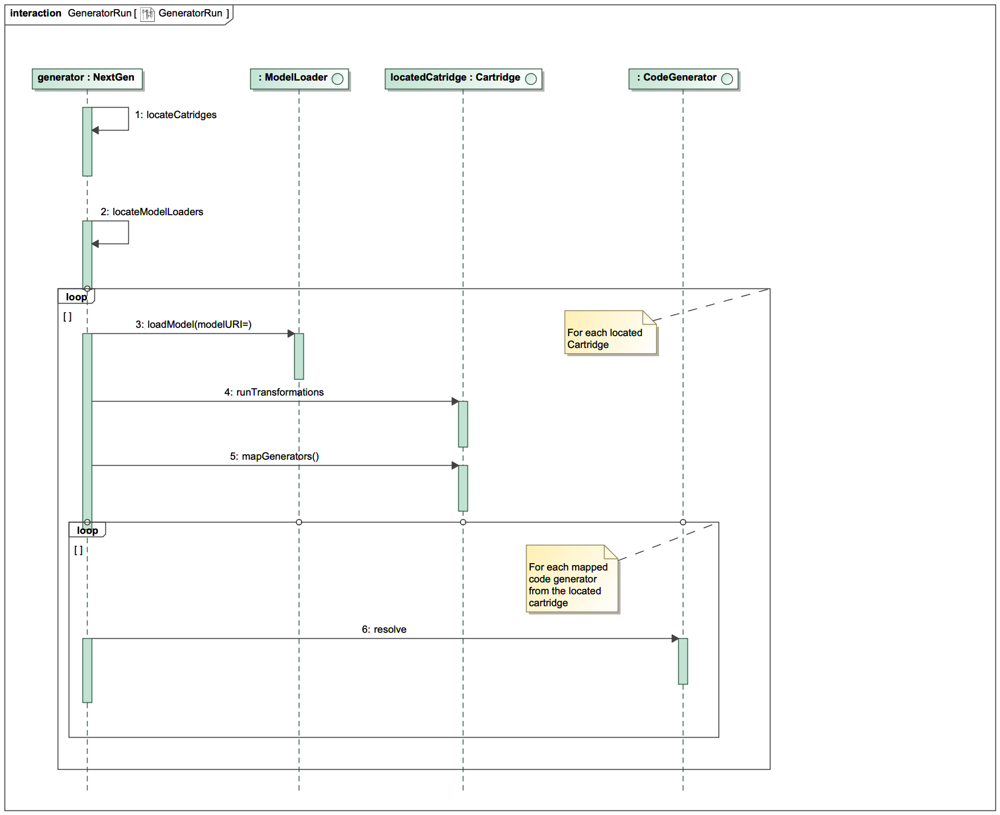

# cgV19 Core

# Introduction and Goals

cgV19-core is the heard of the cgV19 generator framework. It defines the underlying base structure
to describe models, defines a wokrflow for the generation process and provides interfaces
to fill these workflows with logic.

cgV19-core is written in java but can generate every type of output. It is not designed for
any specific output language.

## Requirements Overview

cgV19-core only needs a JDK-8 or higher and has a very low footprint. It's only dependency is groovy
as it is very handy to define a base domain specific language.

There should be no other dependencies in the cgV19-core.

The underlying model for describing your domain model (for example UML) should be simple but
powerfull enough to contain UML Models or Data Model from a Database.

## The base architecture

The main class of cgV19 is NextGen. It's job is described in the following diagramm.



### Meta Model

cgV19-core defines a sctructure for describing nearly all types of models. This structure is
called a _MetaModel_ since it is a model to describe models. It is at its heard a composite 
pattern with ModelElements that contains ModelElements.


The composite pattern is as easy as powerfull for this task. 

### Model Loader

This is an interface defined in cgV19-core. 

```java
public interface ModelLoader {
    boolean canHandle(String modelURI);
    Model loadModel(String modelURI);
}

```
Implementations of this interface tage a input
description (a String) and will create an instance of the MetaModel from this input. The
created MetaModel instance is than returned to the core.

ModelLoader instances are injected to chgV19 via the Java ServiceLoader mechanism. This makes
it possibel to just put a jar-File to the classpath and cgV19 can find the ModelLoader
implementations. 

cgV19-core provides a simple DSL in ModelBuilder.groovy script. These can be used to load a model.

### Cartridge

A cartridge is a plugable component that proveds the generator logic and the output to the 
cgV19-core. Cartridges are located via the java ServiceLoader mechanism and they only need 
to be on the classpath. (With the right service loader file in the META-INF/services directory)

Cartridges will receive a new loaded model from the core and can execute some transformations 
on that model. Ater that the core calls the cartridge to do the (code) generation.

#### Transformations

A transformation is a function of an MetaModel-Instance. It take a MetaModel M and will modify
it somhow to a enhanced Model M'. This model M' is passed to the next Transformation and will 
result in a model M'' and so on.

The last Transformation will produce the final Model M*.

### CodeGenerator
This model M* is than passed to a CodeGeneratorMapping Method. These results in a mapping of
ModelElements in M* to CodeBlockGenerators. These CodeBlockGenerators are a composite pattern 
with a root CodeBlockGenerator. 

These roots will each produce a generated artifact. That can be a Java-File, HTML, JavaScript, PDF
SVG, PHP what ever you want.

## The sequence of a generator run


