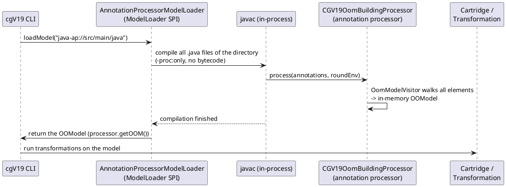
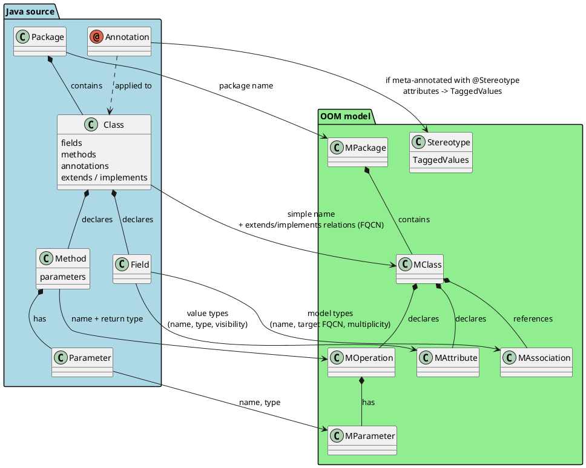

# cgv19-annotationprocessor

Builds cgV19 OOM models directly from annotated Java source code.

## Motivation

cgV19 transformations run on a model (an OOM). Today such models mainly come
from **Visual Paradigm**, a UML tool with an export plugin for OOM files. That
works, but not everyone has – or wants – Visual Paradigm: it is a heavyweight
tool, and its model files are awkward for version control, merging, and having
several people work on one model.

Hand-written OOMs (Groovy DSL scripts or `.oom` files) avoid the tool
dependency, but they offer little authoring support: no syntax checking, no
completion, no refactoring. Writing them is error-prone, and typos only surface
at generation time.

Using **code as the model** gets you the best of both worlds: Java sources enjoy
full git and IDE support (compilation as a syntax check, completion, refactoring,
code review), while this module derives the OOM from them – guided by a small
marker annotation – so cgV19 cartridges and transformations can consume it. The
Java sources become the single source of truth for the model.

The module offers two integration points:

| Integration | What it is | Typical use |
|---|---|---|
| `AnnotationProcessorModelLoader` | A cgV19 `ModelLoader` for the protocol `java-ap://<dir>` | Run generations from the CLI: `cgV19 -m java-ap://src/main/java -c <cartridge>` |
| `CGV19OomBuildingProcessor` | A standard Java annotation processor (ServiceLoader) | Drop the JAR onto a project's `annotationProcessorPath` and let it run during normal builds |

## Concepts

### The big picture



The loader compiles the sources **in-process** (via `ToolProvider.getSystemJavaCompiler()`),
so a JDK is required. The compilation runs with `-proc:only`: no class files are
produced, the only purpose is to let the processor run and build the model.

### The marker annotation `@Stereotype`

The only convention you need: mark your model annotations with the meta-annotation
`de.spraener.nxtgen.ap.metameta.Stereotype`:

```java
@Stereotype
public @interface Entity {
    String tableName() default "";
}

@Entity(tableName = "person")
public class Person { ... }
```

Everything else is derived from that single marker:

- The **processor** discovers such annotations at runtime (see below) – no
  configuration needed.
- Each `@Stereotype`-marked annotation on a model element becomes a **Stereotype**
  in the OOM (named after the annotation's simple name, e.g. `Entity`).
- The annotation's **attributes become TaggedValues** (`tableName = "person"` →
  tagged value `tableName`/`person`). Only explicitly set values are mapped;
  defaults are ignored. Values are stringified: strings/numbers/booleans as-is,
  class literals as FQCN, arrays comma-joined.

> Note: the marker uses `RetentionPolicy.CLASS` (not `SOURCE`). With `SOURCE` it
> would not be present in class files, and the processor could not detect it once
> your annotations are resolved from a JAR.

### What gets mapped



In detail:

| Java element | OOM element | Notes |
|---|---|---|
| Package | `MPackage` | One per distinct package; shared across classes |
| Class / interface | `MClass` | Nested types are **skipped** (the OOM has no nesting concept) |
| `extends` / `implements` | Relation `"extends"` / `"implements"` | Target stored as FQCN; for interfaces, super-interfaces map to `extends` |
| Field with value type (`int`, `String`, …) | `MAttribute` | Type as declared; visibility mapped from modifiers (package-private defaults to `private`) |
| Field with model type (`Address a`, `List<Address> as`) | `MAssociation` | See the heuristic below; collections become to-many (`*`) |
| Method | `MOperation` | Name + return type; constructors are ignored |
| Method parameter | `MParameter` | Name + type |
| `@Stereotype`-marked annotation | `Stereotype` + TaggedValues | On classes, fields and parameters alike |

Not modeled (by design): nested types, enum constants, activities
(`MActivity*` – no Java equivalent), dependencies/usages (would require method
**body** analysis, which annotation processors cannot access), and `MReference`
(model-type fields are represented as associations instead).

### Attributes vs. associations: the root package heuristic

A field like `Address address` could be a plain attribute *or* a reference to
another model class. The visitor decides using the **root package** of the OOM:

- The root package is the *common prefix* of all packages of the compiled types
  (e.g. `com.acme.model` for a model that lives in `com.acme.model` and
  `com.acme.model.sub`).
- A field whose type lives **in or under** the root package is part of the model
  → it becomes an `MAssociation`.
- Everything else (`java.lang.String`, third-party types, …) → plain `MAttribute`.

```plantuml
@startuml
start
:read field type;
if (List / Set / Collection ?) then (yes)
    :unwrap the element type;
    multiplicity=n;
else (no)
    multiplicity = 1;
endif
if (type's package is the root\npackage or a sub-package?) then (yes)
    :create MAssociation\n(name, target FQCN, multiplicity);
else (no)
    :create MAttribute\n(name, type, visibility);
endif
stop
@enduml
```

### In-memory model – no files

The processor builds the `OOModel` **in memory** and exposes it via
`getOOM()`. No model file (Groovy DSL, `.oom`, …) is written. The
`AnnotationProcessorModelLoader` hands that in-memory model straight to cgV19.

### Annotation discovery (wildcard mode)

The processor can run in two modes:

- **Explicit list** – `new CGV19OomBuildingProcessor(Set.of(Entity.class, …))`
  registers exactly those annotations. Used by the loader when configured via
  `withAnnotations(...)`.
- **Wildcard** – the no-arg constructor (the one used when javac instantiates the
  processor via ServiceLoader) registers for `*` and checks at runtime whether any
  annotation present is meta-annotated with `@Stereotype`. If not, it does
  nothing. This makes the processor **zero-configuration**: put the JAR on the
  `annotationProcessorPath` and it activates itself wherever model annotations
  appear.

## Usage

### 1. As a ModelLoader (`java-ap://`)

Make sure the module JAR is on cgV19's classpath (e.g. in the `cartridges/`
directory of your cgV19 installation) – it registers itself via the
`ModelLoader` ServiceLoader file. Then point cgV19 at a directory of Java sources:

```bash
cgV19 -m java-ap://path/to/java/sources -c <cartridgeName>
```

The directory is walked recursively for `.java` files and compiled in-process, so:

- a **JDK** (not just a JRE) is required,
- the sources must compile (the loader fails with a clear error otherwise),
- no class files are produced (`-proc:only`).

By default the loader uses wildcard discovery (see above). To restrict it to
specific annotations:

```java
new AnnotationProcessorModelLoader()
    .withAnnotations(Entity.class, Application.class);
```

If no supported annotation is found in the sources, `loadModel` throws an
`IllegalStateException` instead of returning a null model.

### 2. As an annotation processor in your build

```gradle
dependencies {
    implementation "de.spraener.nxtgen:cgv19-annotationprocessor:24.1.1"
    annotationProcessor "de.spraener.nxtgen:cgv19-annotationprocessor:24.1.1"
}
```

javac discovers `CGV19OomBuildingProcessor` through the standard
`META-INF/services/javax.annotation.processing.Processor` file. In wildcard mode it
activates itself as soon as a `@Stereotype`-marked annotation is used.

> Today the processor only **builds** the in-memory model; it does not generate
> code yet. See [Future Extensions](#future-extensions) for the planned
> Filer-based generation that would make this a Lombok/MapStruct-like experience.

### Example: from annotated source to model

```java
package com.acme.model;

@Stereotype
public @interface Entity { String tableName() default ""; }

@Entity(tableName = "person")
class Person extends BasePerson implements Named {
    String name;
    int age;
    Address address;
    List<Address> addresses;

    public String getName() { return name; }
    public void setAge(int age) { this.age = age; }
}
```

results in:

```text
OOModel
└── MPackage com.acme.model
    ├── MClass Person   [stereotype Entity { tableName = person }]
    │     relation extends    → com.acme.model.BasePerson
    │     relation implements → com.acme.model.Named
    │   ├── MAttribute  name : java.lang.String (private)
    │   ├── MAttribute  age  : int (private)
    │   ├── MAssociation address   → com.acme.model.Address  (1)
    │   ├── MAssociation addresses → com.acme.model.Address  (*)
    │   └── MOperation getName() : java.lang.String
    │         └── (no parameters)
    │   └── MOperation setAge() : void
    │         └── MParameter age : int
    ├── MClass BasePerson { … }
    ├── MClass Address { … }
    └── MClass Named (interface) { … }
```

## Project layout

| File | Role |
|---|---|
| `ap/CGV19OomBuildingProcessor` | The annotation processor; builds the in-memory OOM, computes the root package |
| `ap/OomModelVisitor` | Element visitor that maps Java elements to OOM elements |
| `ap/StereotypeMapper` | Maps `@Stereotype`-marked annotations to Stereotypes + TaggedValues |
| `ap/metameta/Stereotype` | The marker annotation (CLASS retention) |
| `ap/AnnotationProcessorModelLoader` | cgV19 `ModelLoader` for the `java-ap://` protocol |
| `ap/ElementHandler(Registry)` | Reserved extension point for custom element handling (currently unused) |
| `src/test/model/` | Plain Java sources used by the tests (not a Gradle source set) |

## Testing

```bash
cd core
./gradlew :cgv19-annotationprocessor:test
```

The tests compile the sources in `src/test/model` through the real loader and
assert on the resulting model (packages, classes, attributes, associations,
operations, stereotypes) – including the zero-configuration wildcard discovery.

## Future Extensions

Ideas that have been discussed but are not implemented yet:

- **Code generation via the Filer API** – run a cartridge inside `process()` and
  write generated sources, making this a Lombok/MapStruct-like experience in
  normal builds. (Lombok rewrites the annotated class itself; this approach
  generates *additional* files, which is closer to MapStruct/AutoValue.)
- **IDE / incremental build support** – IDEs compile incrementally, so
  `getRootElements()` contains only the changed files and the resulting model is
  *partial* (associations may point at classes that are not in the current
  compilation). Mitigations: restrict modeling to `@Stereotype`-annotated types,
  skip already-generated sources (the `THIS FILE IS GENERATED …` marker), and/or
  gate generation behind a compiler option (e.g. `-AoomGenerate=true`) that only
  full builds set.
- **Scope restriction** – currently *all* compiled types are modeled; for use in
  a regular code base only `@Stereotype`-annotated types should become model
  classes.
- **Enum constants** – enums are modeled as plain `MClass`; the constants could
  be captured via a stereotype + tagged values (the OOM has no `MEnum` type).
- **`MReference`** – currently unused; could be offered as an alternative to
  `MAssociation` for one-to-one references.
- **ServiceLoader SPI for annotation providers** – a `ModelAnnotationProvider`
  service file per annotation library would give precise processor registration
  instead of the `*` wildcard (the wildcard is cheap, but runs in every build).
