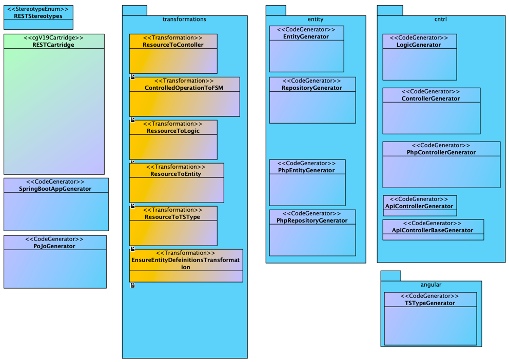

# You are here!

With this cartridge you can develope your own cartridge in a model driven way.

It provides Stereotypes, Transformations and CodeGenerators that make it very easy
to build a cartridge from scratch. This cartridge itself is developed with the
use of this metacartridge.

For example: Here is a screenshot of the (more complex) rest-cartridge model:

