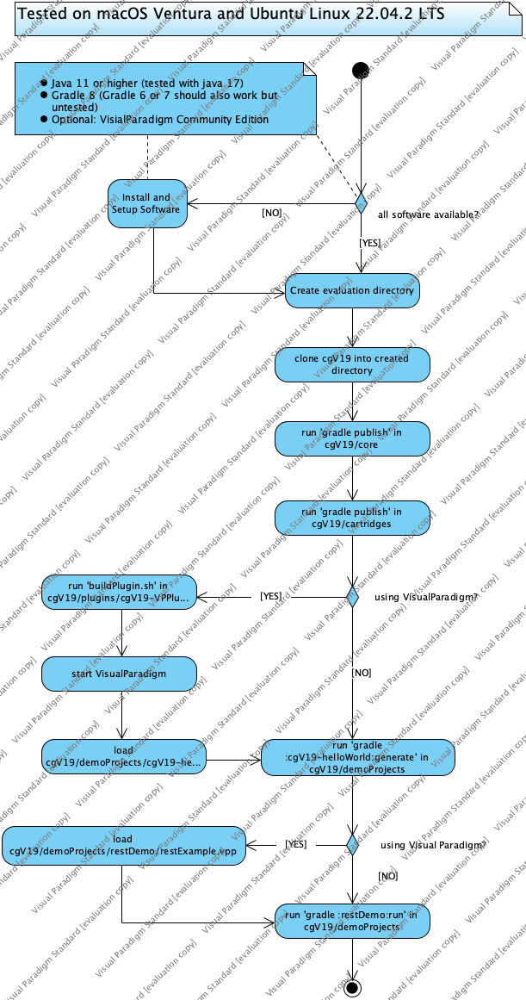
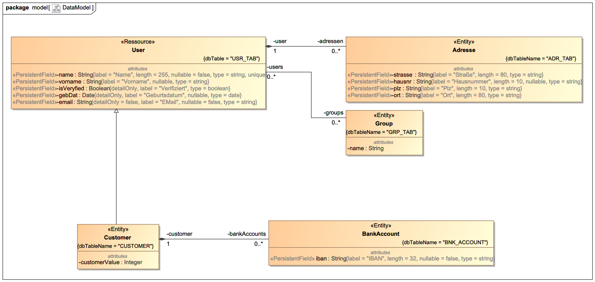

## clone from github and compile yourself



__Setup the Environment__ Clone the cgV9 Project to your workspace, compile and publish all generator
components to a local repository directory.

__Setup the project__ Build a new gradle project, modify the build.gradle to make use of tha cgV19
gradle plugin and tell cgV19 where to find the model description and what it should generate.

__Describe a simple model and do Model driven development__ The last step is to describe a model
with a simple PoJo in a DSL, start the genrate process and look that happens

## Set up the base environment

You need to have the following software installed on your computer:
* Java-SDK 11 or higher
* Gradle 8 (Gradle 6 and 7 may run but untested)
* Optional: [VisualParadigm Community Edition Version 17 or higher](https://www.visual-paradigm.com/download/community.jsp).

If you want to compile cgV19 on your own and using the most recent version, you can
pull it directly from here. Therefore:

Make a directory where you want to start, go into that directory and type:
```
git clone https://github.com/carstenSpraener/cgV19.git
```

This will create a copy of the project in your workspace.


Next step is to build all these projects. To do that change into the directory
core and publish all modules.

```bash
cd cgV19
cd core
gradle publish
```
That will build all core modules and publish them to a local repository in the directory
cgV19/repo. Now that the core is published you can build the plugins and the cartridges.
They depend on the core, so you had to build the core first. Do the following:

```bash
cd ../cartridges
gradle publish
```

You now have the cgV19-RESTCartridge installed in your local repository, and now you can run the final
build of the demo projects.

```bash
cd ../demoProjects
gradle :restDemo:run
```

That should generate the restDemo application and start it as a Spring Boot application on port 8080. You can
test it in you Browser under the URL [http://localhost:8080/users/ping](http://localhost:8080/users/ping)
If that answers with a __Pong__ you are up and running.

Now everything you need is set up. The required artifacts are now
in a local maven repository directory _repo_ under the cgV19 project
directory.

## Running cgv19 as a standalone application

You can use cgv19 as a command line tool without need of gradle. If you go to the
`cgv19-core` directory and build cgv19 as a installDist,

```bash
gradle :cgv19-core:installDist
```
there will be a command
line tool at `cgv19-core/build/install/cgv19`. Copy this folder into an appropriate place
and add the `bin` subfolder to your classpath.

```bash
export PATH=$PATH:<<CGV19_DIR>>/bin
```

To make use of several cartridges just copy them into the `cartridges` subfolder of
your cgv19 installation.

For example to make use of the provided cartridges, your target installation should
look like


## Optional: build and installing VisualParadigm plugin
See: [building-VisualParadigm-Plugin.md](building-VisualParadigm-Plugin.md)


## Defining OOM-Files
The creation of the oom-File by hand is also not very handy. If your
IDE supports groovy-script you will have some kind of syntax highlighting.

But i prefere the use of a UML-Modeling tool like MagicDraw and
install the MDPlugin there. That will give you the power of describing
your model in UML.



And that model will (no MUST) be synchron with your
code. On the long run this will give you a high quality and trustable
documentation.

## What to model and what not to model

Well... that's a good question and a kind of taste. I see nothing
bad at reading an __if__ statement. But 20 if statements can be
hard to understand. If you have such complex situations it's maybe
better to define an activity diagram and abstract to sub activities.

Also the model is and abstraction and that is an absolut MUST! It
does not make sense to model all decisions and let the code be
100% generated. That will lead to a model that is hard to understand
and not debugable.

To find the right way is a question of experience.

## The Generator Gap Pattern

With cgV19 you could definitiv write cartridges that mix hand
writte (manifested) code and generated code in one file. But I
prefer a strict separation of files that are generated and files
that are manifested.

This can easily be achieved with the use of the
__Generator Gap Pattern__. This means you divide a class into two
classes. An abstract 100% generated _*Base_ Class and a manifested
_*Impl_ class that extends the base class. In that way you can put
the Base-classes into the src-gen directory and generate the
templates for the *Impl-Classes into the src directory.

But what could the generator do to not override classes that are
in the java directory, and you enhanced them by hand?

## Protecting from regeneration
Sometimes your generated code is just a template, that the developer
namely you, have to fill in with real code. This code must be protected
from overwriting somehow.

__cgV19__ has a very simple __ProtectionStrategy__. This strategie
looks in the file to be overwritten for a line containing the
string

__THIS FILE IS GENERATED AS LONG AS THIS LINE EXISTS__

If it finds this text in the first 5 lines of the file or if
the file is empty, it will generate the code.

So: If you edited a generated file just remove this line and __cgV9__
will never touch it again. You will surely forget this several times. But I hope
you have a good IDE with a nice UNDO/HISTORY function.
