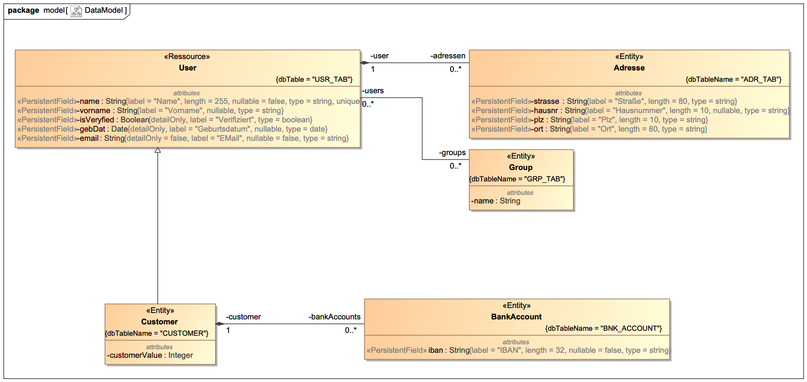

# Getting Started with cgV19

__Stil want to start!__ OK! You are the right kind of developer.

This getting started requires gradle in version 6 or higher. You will run 3 steps:

__Setup the Environment__ Clone the cgV9 Project to your workspace, compile and publish all generator 
components to a local repository directory.

__Setup the project__ Build a new gradle project, modify the build.gradle to make use of tha cgV19
gradle plugin and tell cgV19 where to find the model description and what it should generate.

__Describe a simple model and do Model driven development__ The last step is to describe a model
with a simple PoJo in a DSL, start the genrate process and look that happens 

## Set up the base environment
If you want to compile cgV19 on your own and using the most recent version, you can
pull it directly from here. There for:

Make a directory where you want to start, go into that directory an type:
```
git clone https://github.com/carstenSpraener/cgV19.git
```

This will create a copy of the project in your workspace.

Next step is to build all these modules. For that change into the oom, pojo and
gradle Module and call `gradle jar`.

```
cd cgV19
gradle publish
```

Now everything you need is set up. The required artifacts are now
in a local maven repository directors _repo_ under the cgV19 projec
directory.

__Attention__
This compiles all the modules in cgV19 except the cgV19-helloWorld and the restDemo project. This projects
are not included in the settings.gradle of the root project. This is because they have a chicken egg problem.
They need the cgV19-gradle plugin but that is what need to be published first. So after you publihed all other
cgV19 modules you can now uncomment the two projects and do a second turn:

```
gradle jar
```

## Setup the basic gradle porject

Make a new directory, lets say "helloWorldNxtGen" and copy the following build script into a new build.gradle
 ```groovy
// Make the cgV19 Gradle plugin available to the build.
buildscript {
    repositories {
        maven {
            url "file:/<INSERT_PATH_TO_YOUR_CGV19-DIR_HERE!>/repo"
        }
        mavenCentral()
    }
    dependencies {
        classpath 'de.spraener.nxtgen:cgV19-core:21.0.0-SNAPSHOT'
        classpath 'de.spraener.nxtgen:cgV19-gradle:21.0.0-SNAPSHOT'
    }
}

plugins {
    // Apply the java-library plugin for API and implementation separation.
    id 'java'
}
// apply the plugin to the build script
apply plugin: 'de.spraener.nxtgen.cgV19'

repositories {
    // Use JCenter for resolving dependencies.
    mavenCentral()
    maven {
        url 'file:/<INSERT_PATH_TO_YOUR_CGV19-DIR_HERE!>/repo'
    }
}

dependencies {
}

```
__Attention__ Please replace the string ```<INSERT_PATH_TO_YOUR_CGV19-DIR_HERE!>``` with the real directory
where you build your cgV19 instance (occurs two times). There should be the _repo_ directory.

Also create a new file settings.gradle and insert the following text:

```groovy
rootProject.name = 'helloWorldNxtGen'
```

Now you have initialized a new Application-Project ready to use cgV19.

## Configure cgV19 for your project

Next you need to tell cgV19 where it can find the model (oom-File) to generate from. MagicDraw-Users can use a
URL like http://localhost:7000/<root-package-name> to diretcly build from a MagicDraw-Model while modeling.
But for now we will use an ordinary file. So insert the following line to the ```build.gradle```:

```groovy
cgV19 {
    model = './src/main/helloWorld.oom'
}
 
tasks.withType(JavaCompile) {
    compileTask -> compileTask.dependsOn generate
}
```

This tells the cgV19-Plugin that your model is described in the given file. The second block is to
tell gradle, that all compile task depending on the generate task. So the generate will be executed
before generation starts.

Now you have to tell what cartridges you want to use. This is done via the dependencies block of the
build.gradle file. The cgV19-Plugin defines a new dependency-group __cartridge__. Add all required
cartridges, the cgV19-oom module and the cgV19-core module to this dependency group like follows:

```groovy
dependencies {
    cartridge 'de.spraener.nxtgen:cgV19-core:21.0.0-SNAPSHOT'
    cartridge 'de.spraener.nxtgen:cgV19-oom:21.0.0-SNAPSHOT'
    cartridge 'de.spraener.nxtgen:cgV19-pojo:21.0.0-SNAPSHOT'
}
```

The first two cartridge dependencies are always needed. (Core for shure and you will mostly use a oom-Model)

The generator will generate the java-code inside src/main/java-gen. To tell gradle
that it has another src directory add the following:

```groovy
sourceSets {
    src{
        main {
            java {
                srcDir('src/main/java')
                srcDir('src/main/java-gen')
            }
        }
    }
}
```

That's it. Your project is ready for model driven development with __cgV19__.

## Defining a model

The generator of course needs some sort of model to tell him what to generate. As
we using the pojo-cartridge, which comes with an OOM-ModelLoader we have to
describe the model in an OOM-File. OOM stands for ObjectOrientedModel and is
a groovy implemented DSL to describe thinks like Classes, Attributes, Extends, Operations and so on.

So, create a file helloWorld.oom in src/main and open it in your editor.
Copy this code into your editor and safe the file.
```groovy
import de.spraener.nxtgen.groovy.ModelDSL

ModelDSL.make {
    mPackage {
        name 'de.spraener.nxtgen.hello'
        mPackage {
            name = 'model'
            mClass {
                name 'Person'
                stereotype 'PoJo'
                mAttribute {
                    name 'firstName'
                    type 'String'
                }
                mAttribute {
                    name 'name'
                    type 'String'
                }
            }
        }
    }
}
```

This is the model described in a domain specific laguange (DSL)
as it comes with the oom-Module.

As you can see the model defines a package `de.spraener.nxtgen.hello`
that contains a Class  
`Person` with two attributes `name` and `firstName`. All this
is straight forward.

The one thing, that makes it special is the _stereotype_ definition
on the Class. This marks the class as a PoJo.

Stereotypes telling __cgV19__ what kind of generator is to use. The
PoJo-Cartridge used in the build script maps this stereotyped classes
to the PoJo-Generator which will create a PoJo Java-Class.

## Running the generator
To transform you model in a java class,  start `gradle generate`. This
will create a new source directory `src/main/java-gen` and inside
that directory a package `de.spraener.nxtgen.hello` wich contains...
I think you can emagine.

Now you can use the generated Person-Class inside your code.

# Some notices for real projects

This is a very very tiny usage of a model driven development stragegie
and it is definitivle not worth the overhead. But in real projects
when the complexity is growing you will benefit from the leel of 
abstraction that MDD can reach.

## Defining OOM-Files
The creation of the oom-File by hand is also not very handy. If your
IDE supports groovy-script you will have some kind of syntax highlighting.

But i prefere the use of a UML-Modeling tool like MagicDraw and 
install the MDPlugin there. That will give you the power of describing
your model in UML. 



And that model will (no MUST) be synchron with your
code. On the long run this will give you a high quality and trustable
documentation.

## What to model and what not to model

Well... that's a good question and a kind of taste. I feel nothing
bad in reading an __if__ statement. But 20 if statements cand be
hard to understand. If you have such complex situations it's maybe
better to define a activity diagram and abstract to sub activities.

Also the model is and abstraction and that is an absolut MUST! It 
does not make sense to model all decisions and let the code be 
100% generated. That will lead to a model that is hard tu understand
and not debugable.

To find the right way is a question of experience. 

## The Generatror Gap Pattern

With cgV19 you could definitfle write Cartridges that mix hand 
writte (manifested) code and generated Code in one file. But i 
prefere a strict seperation of files that are generated and files
taht are manifested.

That can easily be achieved with the use of the 
__Generator Gap Pattern__. This means you devide a class into two
classes. An abstract 100% generated _*Base_ Class and a manifested
_*Impl_ class that extends the base class. In that way you can put
the Base-classes into the java-gen directory and generate the 
templates for the *Impl-Classes into the java directory. 

But what could the generator do to not override classes that are 
in the java directory and you enhancced them by hand?

## Protecting from regeneration
Sometimes your generated code is just a template, that the developer
namely you, have to fill in with real code. This code must be protected
from overwriting some how.
__cgV19__ has a very simple __ProtectionStrategy__. This strategie
looks in the file to be overwritten for a line containing the
string

__THIS FILE IS GENERATED AS LONG AS THIS LINE EXISTS__

If it finds this text in the first 5 lines of the file or if
the file is empty, it will generate the code.

So: If you edited a generated file just remove this line and __cgV9__
will never touch it again.
