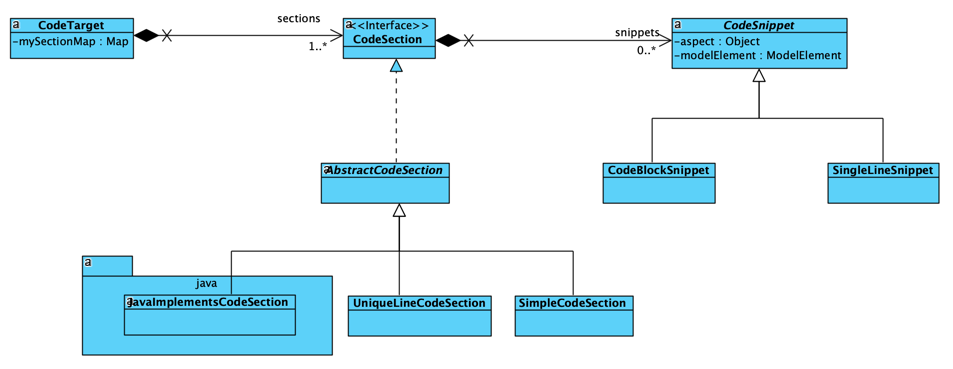

# cgV19 Release 23.1

This release brings some exciting new features to cgV19.

## [Support for JavaPoet](https://github.com/square/javapoet)

You can use Java-Poet to implement your CodeGenerators for Java from an MClass-Instance.

See [the README in module core/cgv19-javapoet](../core/cgv19-javapoet/README.md)

## <a name="codeTargets"></a>Introducing the new concept of CodeTargets



### Don't reinvent the wheel
With CodeTargets, it is possible to build reusable Generators so that cartridge A can
use the CodeGenerator of cartridge B and enhance it. So, if you want to generate an Entity
with your EntityGenerator, it can call a PoJoGenerator from another Cartridge and add the
JPA-Annotations as required. This is possible because a CodeTarget divides an output file into
sections that have snippets. Each snippet is addressable; you can add new snippets before, after, or even replace them.

### Keep things together
Another main advantage is that in a CodeTarget-based Generator, the code necessary to implement a specific aspect will stay together. In a classic template Generator, this aspect is  spread out over several
sections of an output file.

### Examples of using CodeTargets

See the JUnit-Test for code modification with CodeTarget
[test example in CodeTargetModificationTest](../core/cgv19-core/src/test/java/de/spraener/nxtgen/target/CodeTargetModificationTest.java)

#### A new and reusable PoJo-Generator
With the introduction of CodeTargets, the good old PoJo-Generator used
as a template for cartridge creation can become an entirely new role. Now it can be the base for many other generators. Here is the new PoJo-Generator based on
the CodeTarget-Concept: (see [PoJoGenerator.java](../core/cgv19-pojo/src/main/java/de/spraener/nxtgen/pojo/PoJoGenerator.java))

```Java
public class PoJoGenerator implements CodeGenerator {
    @Override
    public CodeBlock resolve(ModelElement element, String templateName) {
        MClass mc = (MClass)element;
        JavaCodeBlock jCB = new JavaCodeBlock("src/main/java-gen", mc.getPackage().getFQName(), mc.getName() );
        jCB.addCodeBlock(new CodeTargetCodeBlockAdapter(new PoJoCodeTargetCreator(mc).createPoJoTarget()));
        return jCB;
    }
}
```

The critical part is the `new PoJoCodeTargetCreator(mc).createPoJoTarget()`. This creates
a new PoJoCodeTargetCreator provides a CodeTarget filled with the PoJo-Code of an MClass ModelElement.

The Creator looks like this:
```java
public class PoJoCodeTargetCreator {
    public static final String POJO_ASPECT = "pojo-frame";
    public static final String DEFAULT_CONSTRUCTOR = "pojo-default-constructor";
    public static final String ATTRIBUTE_ASPECT = "pojo-attribute";
    public static final String ASSOCIATION = "pojo-association";
    private MClass pojo;

    public PoJoCodeTargetCreator(MClass pojo) {
        this.pojo = pojo;
    }

    public CodeTarget createPoJoTarget() {
        CodeTarget target = JavaSections.createJavaCodeTarget("//" + ProtectionStrategieDefaultImpl.GENERATED_LINE);
        target.inContext(POJO_ASPECT, pojo,
                this::declarePackage,
                this::declareClazz,
                this::declareExtends,
                this::declareImplements,
                this::createConstructor
        );
        new PoJoAttributesCreator().accept(target, pojo);
        new PoJoAssociationCreator().accept(target, pojo);
        return target;
    }
    // More methods with CodeTarget parameter ...

    protected void createConstructor(CodeTarget target) {
        target.inContext(DEFAULT_CONSTRUCTOR, pojo, t -> {
            StringBuilder sb = new StringBuilder();
            sb.append("    public " + pojo.getName() + "() {\n");
            sb.append("    }\n");
            t.getSection(JavaSections.CONSTRUCTORS)
                    .add(new CodeBlockSnippet(sb.toString()));
        });
    }
}
```

Each of the produced CodeSnippets can now be addressed by the Section, Aspect, and ModelElement.

If another Cartridge wants to be all PoJos implements the Serializable-Interface, it can use this PoJo-CodeTarget and enhance it like:

```java
CodeTarget target = new PoJoCodeTargetCreator(pojo).createPoJoTarget();
new SerializableEnhancer(pojo).accept(target);
```

Where the SerializableEnhancer just applies the code necessary to implement the
Serializable interface:

```java
public class SerializableEnhancer implements Consumer<CodeTarget> {
    public static final String SERIALIZABLE = "serializable";
    private MClass mClass;

    public SerializableEnhancer(MClass mClass) {
        this.mClass = mClass;
    }

    @Override
    public void accept(CodeTarget target) {
        target.inContext(SERIALIZABLE, this.mClass, t -> {
            // Add the import to the import section
            t.getSection(JavaSections.IMPORTS)
                    .add(new SingleLineSnippet("import java.io.Serializable;"));

            //Add an "implements" to the class declaration
            t.getSection(JavaSections.IMPLEMENTS)
                    .add(new CodeBlockSnippet("Serializable"));

            // add a serialVersionUID as a static fields
            t.getSection(JavaSections.CLASS_BLOCK_BEGIN)
                    .add(new CodeBlockSnippet("""
                                 private static final long serialVersionUID=1L;
                                 
                            """));
        });
    }
}
```

## Annotation based cartridges

The creation of your own cartridge gets much easier with the annotation
approach. You can create a subclass of AnnotatedCartridgeImpl

```java
@CGV19Cartridge("PoJo-Cartridge")
public class PoJoCartridge extends AnnotatedCartridgeImpl {
}
```

The classes in the package of this class and all its subpackages are scanned for classes
annotated with @CGV19Generator, @CGV19Transformation, @CGV19MustacheGenerator or @CGV19Component.

Each of these classes represent a CodeGenerator, a Transformation or a Class with methods
that representing a Generator or Transformation.

See [PoJoGenerator.java](../core/cgv19-pojo/src/main/java/de/spraener/nxtgen/pojo/PoJoGenerator.java)
as an example of how to use the annotations.

Listing the transformations or mapping the generators  to 
model elements is done by the AnnotatedCartridgeImpl. No
need to implement that.

Here the annotation part of the PoJo generator:

```java
@CGV19Component
public class PoJoGenerator {

    @CGV19Transformation(
            requiredStereotype = PoJoCartridge.ST_POJO,
            operatesOn = MClass.class
    )
    public void doTransformation(ModelElement me) {
        ...
    }
    
    @CGV19Generator(
            requiredStereotype  PoJoCartridge.ST_POJO_BASE,
            outputTo = OutputTo.SRC,
            outputType = OutputType.JAVA,
            operatesOn = MClass.class,
            implementationKind = ImplementationKind.CLASS_TARGET
    )
    public CodeBlock generatePoJoBase(ModelElement element, String templateName) {
        ...
    }
    
    @CGV19Generator(
            requiredStereotype = PoJoCartridge.ST_POJO,
            outputTo = OutputTo.SRC_GEN,
            outputType = OutputType.JAVA,
            operatesOn = MClass.class,
            implementationKind = ImplementationKind.CLASS_TARGET
    )
    public CodeBlock generatePoJo(ModelElement element, String templateName) {
        ...
    }
}
```
## <a name="mustache"></a>[Mustache Support](https://github.com/spullara/mustache.java)
Mustache is a template engine, that is very handy when the output file is linear and
logic free. This is often the case for propertie files, Dockerfile or build scripts.

With mustache, you can create your output files with a
mail merge concept. Filling some data provider with data
and reference these data in the template.

To implement a Mustache generator just implement a 
method inside a @CGV19Component annotated class like 
the following:

```java
@CGV19MustacheGenerator(
        value="build.gradle",
        requiredStereotype="SpringBootApp",
        operatesOn= MClass.class,
        templateResource="/mustache/springBootApp/build.gradle.mustache"
)
public static void fillBuildScriptMap(ModelElement modelElement, Map<String, Object> mustacheScope) {
    MClass app = (MClass) modelElement;
    mustacheScope.put("springBootVersion", "3.1.0");
    mustacheScope.put("springDependencyManagementVersion", "1.1.0");
    mustacheScope.put("app.group", ((MPackage)app.getPackage().getParent()).getFQName());
    mustacheScope.put("app.version", "0.0.1-SNAPSHOT");
    mustacheScope.put("javaSourceVersion", "17");
    mustacheScope.put("applicationMainClass", app.getFQName());
    List<Map<String, String>>  implementationDependencies = new ArrayList<>();
    mustacheScope.put("implementationDependencies", implementationDependencies);
    implementationDependencies.add( Map.of("coordinates", "org.springframework.boot:spring-boot-starter-oauth2-resource-server"));
    implementationDependencies.add( Map.of("coordinates", "org.springframework.boot:spring-boot-starter-oauth2-client"));
}
```

