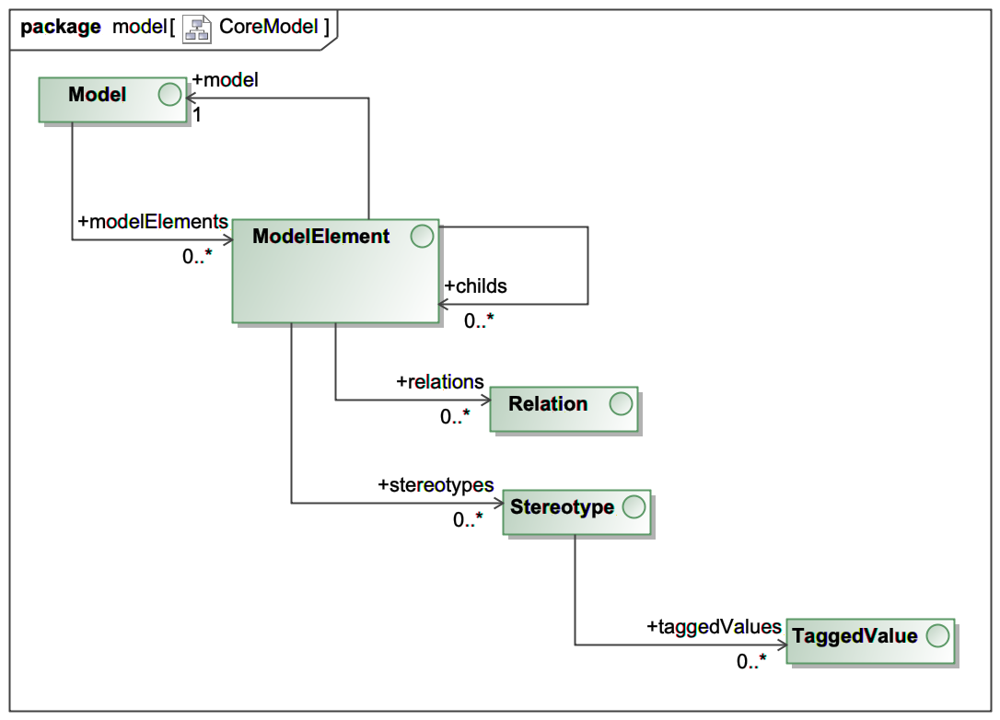

# A brief history
In 2002, I started to work on a project for an insurance company in germany. The goal was to build
an application for insurance estimates. The problem was it has to run in multiple channels
on the web or as a pure swing application. And in 2002 this was a real task.

We decided to work with a self programmed code generator called __CodeGen__. This generator
has gone several releases and is still in work for the project.

In 2019, I started to recreate the whole generator from scratch. This is the
beginning of __cgV19__

In __cgV19__ I implemented several features I missed in CodeGen. It has a new
concept of so-called __cartridges__. Yes think of it as the old hardware
modules to plug into your game console. 

It has a self generated metamodel and the loading of a model can be
plugged in from classpath.

Dependencies are very low. The core module only depends on Groovy.
Groovy is a language on top of java that is predestined for generation
and defining DSLs.

While the old CodeGen had a very special model type (xml), __cgV19__
has a java metamodel, that can be extended and created from nearly
every type of data.

__cgV19__ comes with a plugin for gradle. You can add it to your build.gradle and
the generator will run before the compile task starts.

It is not a big monolith but split in several modules. 

