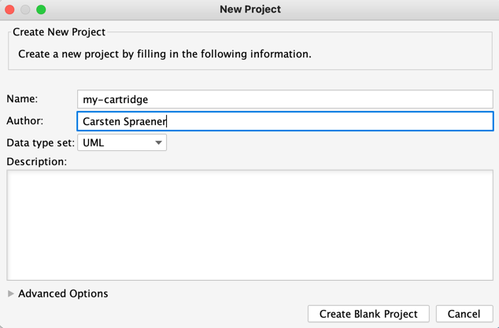
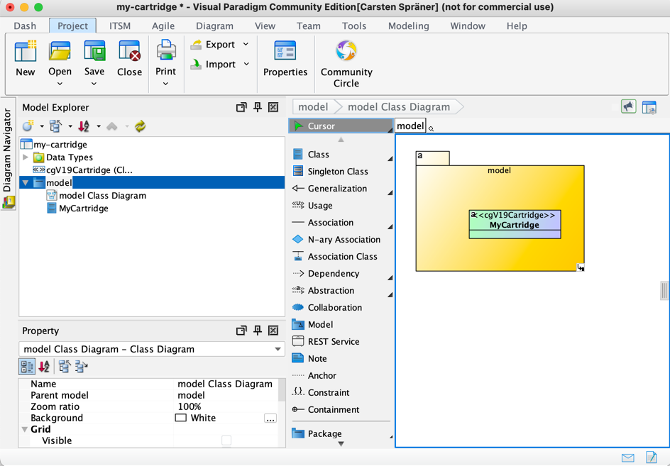
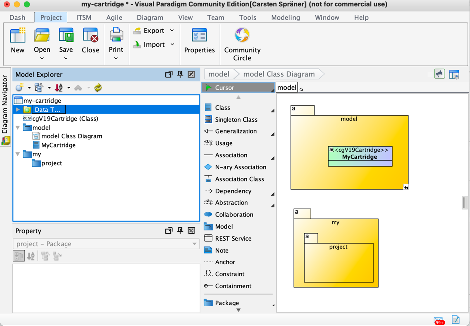

# Building and installing the VisualParadigm plugin

cgV19 provides a plugin for VisualParadigm. With VP installed and setup correctly you
will be able to generate your code directly while  modeling in VP. [VP has a community
edition](https://www.visual-paradigm.com/download/community.jsp) which is completely
sufficient for your first steps. (And far beyond)

If you want to give it a try install the community edition on your system. Then follow
this steps to build and install the cgV19-VPPlugin.

* [CloneAndBuildYourself](CloneAndBuildYourself.md)
* Go to the folder `cgV19/plugins/cgV19-VPPlugin`
* run the bash script buildPlugin.sh inside the cgV19-VPPlugin folder (tested under macOS and Linux)
* restart VisualParadigm and check the plugin. The link http://localhost:7001/ping should
  response with a "pong!"

YES! You successfully installed the cgV19-VPPlugin into your VisualParadigm.

## Using VisualParadigm with cgv19 in your project

Now, that you installed the plugin and installed cgv19 you may want
to know, how to combine them into a workflow. Quite easy! Let's take
the project "my-cartridge" form the [GettingStarted.md](GettingStarted.md)
and let's use VisualParadigm to define our cartridge. 

Also let's define a second project, that uses this cartridge to develop
some application.

### Modify my-cartridge to make use of VisualParadigm plugin.

In the [GettingStarted.md](GettingStarted.md) you were told to 
set the modle for cgv19 to __model.oom__. This is done in the 
build.gradle like:

```groovy
// Configure cgV19 to read this model
cgV19 {
    model = "model.oom"
}
```
Let's change this configuration to this:
```groovy
// Configure cgV19 to read this model
cgV19 {
  model = "http://localhost:7001/model"
}
```
Now start VisualParadigm with the cgV19-Plugin installed and create
the following model:


In that project create a new Package model and inside the model package
a new class MyCartridge with a stereotype "cgv19Cartridge"

The model should look like this:

__Notice:__ the package is named __model__ which correspond
to the model URL given in the build.gradle

## Using the opened model with gradle

Now go back to the command shell in the my-cartridge folder and restart
```bash
 gradle cgV19
```
Your log should look something like:

```log
Mai 29, 2023 3:42:57 PM de.spraener.nxtgen.NextGen run
INFORMATION: starting codegen in working dir my-cartridge/. on model file http://localhost:7001/model
Mai 29, 2023 3:42:57 PM de.spraener.nxtgen.NextGen loadCartridges
INFORMATION: found 2 cartridges [MetaCartridgeBase, ObjectOrientedMetamodel-Cartridge] as service.
```
and all your code is re-generated. (If you want you can remove the src folder and start again.)

__Congratulations!__ You have just coupled cgV19 in gradle with VisualParadigm. __Great Job!__

### What if Visual Paradigm is not running?

OK, in that case cgV19 will load the model.oom from the file system. 

To get a fresh copy of your model into the projects folder do a 
```bash
wget -O model.oom http://localhost:7001/model
```
This is especially needed, if you build your project on a build server,
where now VisualParadigm is running.

## Using your own cartridge in your own Project
OK! Now we come to the _yellow of the egg_ (as we say in germany)

In a real project you need to provide your own code generator to help you
in your own project. Let's get started!

### Create a second (consuming) Project

Next to your _my-cartridge_ project create second project _my-project_
and copy the build.gradle of the _my-cartridge_ project into this new
project.

So inside the _my-cartridge_ project do
```bash
cd ..
mkdir my-project
cp my-cartridge/build.gradle my-project
```

#### Combine both projects into one multi build project
In the root-folder of both projects create a new settings.gradle 
with the following content:
```groovy
include ('my-cartridge','my-project')
```

This combines both project into one multi build project.

#### Make use of your my-cartridge in your my-project

To use your _my-cartridge_ inside your _my-project_ just update the
dependencies inside the _my-project_ build.gradle as follows:

```groovy 
dependencies {
    // apply this cartridges to cgV19 so we can generate something
    cartridge 'de.spraener.nxtgen:cgv19-core:23.0.0'
    // oom-loader is responsible to load Object Oriented Models
    cartridge 'de.spraener.nxtgen:cgv19-oom:23.0.0'
    cartridge project(':my-cartridge')

}
```
You don't need any implementation dependencies to cgV19 just the 
cartridges. 

The reference to your cartridge come via a project dependency.

You may also change the model on which cgV19 is working into some other.
For example:

```groovy 
// Configure cgV19 to read this model
cgV19 {
    model = "http://localhost:7001/my.project"
}
```

Let's have a look what cgV19 has to say:

```bash
cd my-project
gradle cgV19

Mai 29, 2023 4:10:55 PM de.spraener.nxtgen.NextGen run
INFORMATION: starting codegen in working dir .../my-project/. on model file http://localhost:7001/my.project
Mai 29, 2023 4:10:55 PM de.spraener.nxtgen.NextGen loadCartridges
INFORMATION: found 3 cartridges [MyCartridge, MetaCartridgeBase, ObjectOrientedMetamodel-Cartridge] as service.
Mai 29, 2023 4:10:56 PM de.spraener.nxtgen.oom.model.OOMModelLoader openModel
INFORMATION: Error loading model via URL 'http://localhost:7001/my.project'. Try to load file 'my.project.oom'.
Mai 29, 2023 4:10:56 PM de.spraener.nxtgen.oom.model.OOMModelLoader openModel
INFORMATION: Can not load file 'http://localhost:7001/my.project'. Giving up...
java.lang.IllegalArgumentException: No such model.
        at de.spraener.nxtgen.oom.model.OOMModelLoader.openModel(OOMModelLoader.java:76)
        at de.spraener.nxtgen.oom.model.OOMModelLoader.loadModel(OOMModelLoader.java:27)
        at de.spraener.nxtgen.NextGen.loadModels(NextGen.java:140)
        at de.spraener.nxtgen.NextGen.run(NextGen.java:116)
        at de.spraener.nxtgen.NextGen.main(NextGen.java:201)
```
Ups! We are getting an error. But that's ok because at the moment there
is now "my.project"-Model.

Much more noticeable is the list of cartridges, that cgV19 loads. As you
may see in the log it loads the new "MyCartridge". If not, go to the
my-cartridge project, start ```gradle jar``` and then start ```gradle cgV19```
inside the _my-project_ again.

But to make cgV19 inside my-project satisfied let's do one more step

### Create a 'my.project' package inside VisualParadigm

Go back to VisualParadigm and create a package "my" and inside that
package another Package "project" as shown below:



If you start cgV19 inside my-project again it now looks ok:

```bash
gradle cgV19

> Task :my-project:cgV19
Mai 29, 2023 4:18:23 PM de.spraener.nxtgen.NextGen run
INFORMATION: starting codegen in working dir ...my-project/. on model file http://localhost:7001/my.project
Mai 29, 2023 4:18:23 PM de.spraener.nxtgen.NextGen loadCartridges
INFORMATION: found 3 cartridges [MyCartridge, MetaCartridgeBase, ObjectOrientedMetamodel-Cartridge] as service.
```
__Fantastic!__ the basic setup for model driven development is done.

## What next?
Now you can start defining your own domain specific language by defining
_Stereotypes_, _Transformations_, and _CodeGenerators_ inside your 
__model__ and use them in your __my.project__ package to describe
your program.
