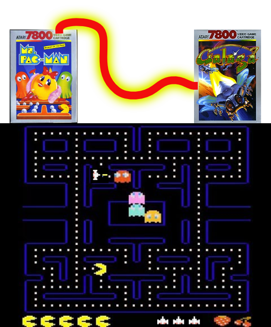
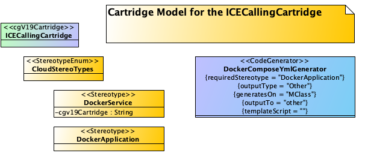
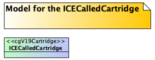

### Imagine...

Imagine a gaming console like an ATARI 7800 would be able to use multiple cartridges. Not only one. And you can use them together to make your game more exciting... Like Combining Pac-Man with Galaga and out of the sudden Pac-Man gets help from a spaceship. What would that sound like?  



# Welcome to Inter Cartridge Evaluation (ICE)
__This is an advanced topic__ 

In some environments, it makes sense to create a frame from a parent cartridge like a cloud application cartridge. This cartridge needs to generate a docker-compose.yml where all subprojects need to be listed. 

It would be very nice if the cloud cartridge doesn't need to know anything 
about its subprojects and how to generate the service block of each. It 
would be much better if the subproject knows about it. An angular frontend may need a different service block than an api service or a database service.

With ICE, the calling cartridge (like pac-man) calls the called cartridges 
(like galaga) for help with the generation of the overall docker-compose.yml. 
It does it by calling ```NextGen.evaluate...()```.

It can also start generating the subprojects by scheduling cgV19-runs on each included subproject with ```NextGen.scheduleInvocation()```.

### Make aspects configurable

Another use case is the PoJoCartridge included in the cgV19 core. This 
cartridge can generate PoJos with its attribute definitions, inheritance 
access methods to the attributes and can even handle one-to-many 
associations. But it doesn't know how your project wants to deal with lets 
say activity diagramms. These diagrams can be used to describe complex 
methods in a readable diagram. But there are several ways to implement it.

The PoJoCartridge does not deal with activity diagrams, but it calls 
```NextGen.subEvaluate``` during the generation process of a class. The 
_subEvaluate_ method takes a EvaluationRequest parameter, and cgV19 will 
search for a cartridge that is able to fulfill this request.

If it finds one, it will delegate the request to this cartridge. If not, it 
will leave the result empty.

## The ICE Example

To demonstrate ICE it is necessary to have at least two cartridges inside 
cgV19. In this example these cartridges are ICECallingCartridge, which tries 
to generate a docker-compose.yml. 



The second cartridge is the ICECalledCartridge. This cartridge provides the 
service definition for a MPackage with stereotype ```<<DockerService>>```.



### The ICECallingCartridge logic
Inside the DockerComposeYmlGenerators Groovy-Template is a call to a method 
inside the ICECallingCartridge.

```groovy
"""# ${ProtectionStrategieDefaultImpl.GENERATED_LINE}
version: '3'

services:
${ICECallingCartridge.evaluateDockerComposeServices(model)}
"""
```

This method searches for MPackages with stereotype ```<<DockerService>>``` 
and sends a EvaluationRequest to NextGen for each located MPackage:

```java
    public static String evaluateDockerComposeServices(OOModel ooModel) {
        StringBuilder sb = new StringBuilder();
        for( MPackage cloudModule : listDockerServices(ooModel) ) {
            String cartridge = cloudModule.getTaggedValue(CloudStereoTypes.DOCKERSERVICE.getName(), "cgv19Cartridge");
            Stereotype sType = StereotypeHelper.getStereotype(cloudModule, CloudStereoTypes.DOCKERSERVICE.getName());
            sb.append(
                    NextGen.evaluateByGiven(cartridge, new EvaluationRequest(cloudModule, sType, "docker-compose", ""))
            );
        }
        return sb.toString();
    }
```

The method lists all matching MPackages, reads the target cartridge from the 
tagged value _cgv19Cartridge_ and calls NextGen to evaluate via that cartridge.
It then adds the result to a StringBuffer. 

__Note:__ The calling cartridge defines the model structure (MPackage with 
stereotype ```<<DockerService>>``` and target cartridge name in the 
_cgv19Cartridge_ tagged value). The called cartridge has to react on this.

### The ICECalledCartridge logic

The ICECalledCartridge on the other side implements the method evaluate:

```java
@Override
public String evaluate(EvaluationRequest r) {
    CodeGeneratorMapping mapping = this.createMapping(r.getMe(), r.getStereotype().getName(), r.getAspect());
    if (mapping == null) {
        return "Unsupported evaluation request for ModelElement '" + r.getMe().getName() + " with aspect: '" + r.getAspect() + "'";
    }
    return mapping.getCodeGen().resolve(r.getMe(), "").toCode();
}
```
The ICECalledCartridge recognizes the request and generates a String that
must be placed in the generated artifact. It makes the decision on the 
information provided by the Request like Model m, the ModelElement (a 
MPackage in this case), the Stereotype and an aspect describing string (__docker-compose__ in this case). It than returns a String to fill into the ```docker-compose.yml```.

_The concrete implementation uses a GeneratorMapping and resolves the code. 
But that is an implementation detail._

## PoJoEnhancement

As mentioned earlier the PoJoCartridge supports the use of an activity 
diagramm cartridge to implement complex workflows in a method call. 

### The PoJoCartridge request sending

At the end of the CodeTarget-Building it calls NextGen to check for a 
cartridge that can fulfill an activity diagramms request:

```java
            target.inContext(POJO_ASPECT, pojo,
                    ct -> new PoJoAttributesCreator().accept(ct, pojo),
                    ct -> new PoJoAssociationCreator().accept(ct, pojo),
                    ct -> {
                        // if the pojo has any activities try to resolve them with another cartridge
                        // that supports activity generation.
                        for(MActivity activity : pojo.getActivities() ) {
                            EvaluationRequest activityRequest = new EvaluationRequest(
                                activity,
                                PoJoCartridge.POJO_STEREOTYPE,
                                PoJoCartridge.ACTIVITY_ASPECT,
                                ct
                            );
                            NextGen.evaluateByAny(activityRequest);
                        }
                    }
            );
```
The important code is the creation of the __EvaluationRequest__ and the call 
to ```NextGen.subEvaluate(activityRequest)```

The PoJoCartridge itself is implemented as a CodeTarget generator. This
means it does not use classical groovy templates to generate the code
_top-down_ but doing it more aspect oriented with a JavaCodeTarget.

This enables another cartridge, which wants to inject the code for an 
activity diagram to set the imports, the required attributes and all methods 
needed into the CodeTarget with only one call.

### A fulfilling cartridge

At the moment, there is no cartridge for activity diagram implementation. But 
there is a test case, which is used here to demonstrate the concept.

The test case is part of the PoJoCartridge test suite. Here are the 
important statements:

```java
public class TestActivitySubEvaluation {
    private Cartridge activitySupportingCartridgeMock = mock(Cartridge.class);
```
The test case mocks a second cartridge to generate some content when 
requested. This mock is set up in the @Before method of the test case.

```java
        NextGen.addCartridge(activitySupportingCartridgeMock);
        when(activitySupportingCartridgeMock.subEvaluate(any(EvaluationRequest.class))).thenAnswer(i-> {
           EvaluationRequest req = i.getArgument(0);
           return subEvaluate(req);
        });
        when(activitySupportingCartridgeMock.canHandle(any(EvaluationRequest.class))).thenReturn(true);
```
It answers a call to ```canHandle``` with true and delegates the call to 
```subEvaluate()``` to an internal method.

This method is here:
```java
    public CodeBlock subEvaluate(EvaluationRequest request) {
        CodeBlock result = null;
        if (request.getAspect().equals(PoJoCartridge.ACTIVITY_ASPECT)) {
            MActivity activity = (MActivity) request.getMe();
            CodeTarget target = request.getCodeTarget();
            target.getSection(JavaSections.IMPORTS).add("fsmImports", "//// Import for the FSM-Implementation\n");
            target.getSection(JavaSections.ATTRIBUTE_DECLARATIONS)
                    .add("fsmFields", request.getMe(), "// required fields for fsm-Implementation of " + activity.getName() + "\n");
            target.getSection(JavaSections.METHODS)
                    .add("fsmMethods", request.getMe(), "// method for fsm-Implementation of " + activity.getName() + "\n");
        }
        return result;
    }
```
The implementation adds the code to several sections of the CodeTarget. This 
is possible only in CodeTarget generators. If you have a template driven 
generator you may have to do several calls for each of this section with 
different sub aspects like _import_ _attributes_ and _methods_.

The resulting code is then checked in the test case to contain the generated 
strings:

```java
    @Test
    public void testPoJoCartridgeActivityOnJavaCodeTarget() throws Exception {
        CodeBlock cb = new PoJoGenerator().generatePoJoBase(model.findClassByName("a.APojoBase"), "");
        String code = cb.toCode();
        Assertions.assertThat(code)
                .containsIgnoringWhitespaces("// required fields for fsm-Implementation of " + activity.getName())
                .containsIgnoringWhitespaces("// method for fsm-Implementation of " + activity.getName())
                .containsIgnoringWhitespaces("// Import for the FSM-Implementation")
        ;
    }
```
In a real activity implementation, this could be the imports of 
spring-state-machines, real attribute declarations and a method to call the 
activity.

## Conclusion

With ICE you can orchestrate your generator with several cartridges to build 
complex structures like K8S applications with multiple services each 
implemented in its own technology.

You can also inject several ways to deal with certain model elements like 
activity diagrams in a PoJo.

