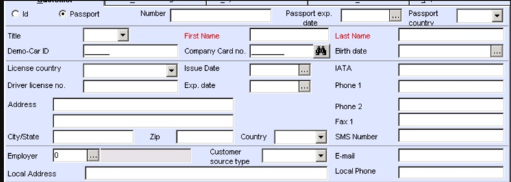
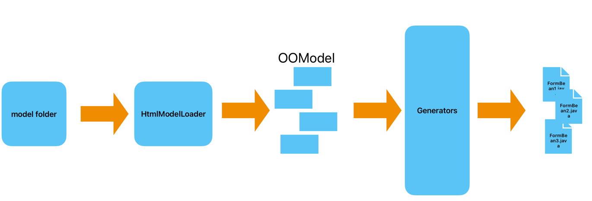
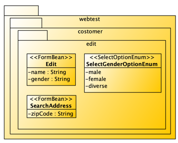
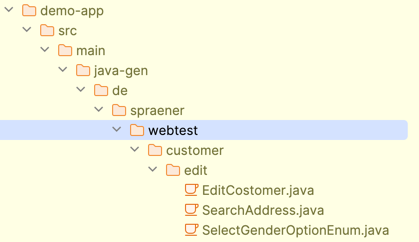

## cgV19 for web testing huge applications

In one of my projects, we had to maintain an ancient application. Once upon a time, the customer believed a new, modern successor would replace the application. However, as it happens so often, the successor has its own problems and is postponed repeatedly. So, instead of landing in the digital trash can, the old application keeps the business running and has aged through the years.

Some required libraries were no longer supported, and others prevented the application from moving from Java 8 to Java 11. In addition, the old business experts left the project, or even the company and knowledge drained into the void. As an external project member, the whole software was a black box.

When maintaining such a black box and updating core libraries like Hibernate or Spring, there is only one way to keep the application running. You have to test every change. Moreover, that means a lot of human resources or some kind of test robot like Selenium to keep the application under steam.

## Help me! Please help me!
One of the main tasks when testing an application with Selenium is finding the best XPath expression to select just the correct input field. This could be very challenging. If you have an application with massive forms with hundreds of fields, it is the main task of your job.

__Example of a huge html form__



You have to know one thing about me: I hate monotonous jobs and do everything to avoid them. Help was needed, and that was where cgV19 came into play.

## The basic idea
Wouldn't it be possible to read the HTML pages, create an OOM from the forms, and generate some kind of _FormBean_ from that OOM? The _FormBean_ mirrors the form of a simple PoJo. The attributes in the PoJo could be annotated with an XPath-Expression and all required information so that a generic _FormBeanHandler_ could transfer the data from the PoJo into the form and vice versa. Parsing the HTML is a piece of cake with the JSoup library. Creating an OOM should be pretty easy, and generating the PoJos is one of the standard tasks of cgV19. Sounds ... _easy_




The cherry on the cake would be generated enumerations for select values and radio button groups. Okay, that's manageable.

## The FormBeanHandler
The FormBeanHandler is the core of the whole idea. This class comes with a set of annotations. It reads the meta information from the class file, gets the value of each attribute via reflection, and sends the value to the Selenium driver. It needs to know the exact XPath to the WebElement and its type. Some HTML form elements, like selects or checkboxes, are handled differently from the normal input form element.

So the FormBeanHandler knows an annotation ```@FormField(xpath, type)```. This annotation can be added to any attribute. All attributes are of the type ```String```.

__Note:__ This is typically in a model-driven project. You have a core that can deal with generic classes, which are then generated from the generator framework.

## The webtest cartridge

In cgV19, the integration point is a cartridge. A cartridge provides the logic to generate the artifacts for a specific domain. In this showcase, We Will Demonstrate Web testing with Selenium.

### The HTML model reader
Each cartridge can provide a _ModelReader_. The model reader for this project can read html-pages from a _model_ directory. It reads recursively all the html pages from that model directory and creates an _ObjectOrientedModel_ __OOM__.

__Example file structure:__
```bash
model
+--customer
   +--edit.html    
```

__Example edit.html__
```html
<html>
...
<body>
...
   <form id="editCostomer">
       <input id="name"/>
       <select id="gender">
           <option value="m">male</option>
           <option value="f">female</option>
           <option value="d">diverse</option>
       </select>
   </form>
  <form id="searchAddress">
      <input id="zipCode"/>
  </form>
</body>
</html>

```
The __OOM__ comprises packages, classes, and attributes. Each subdirectory of the model folder will result in a new package. Each HTML page will also result in a package, and each form inside an HTML page will result in a _FormBean_ class. Oh! That sounds like our first << Stereotype >>.

Every input-, select-, textarea, and other elements to enter data inside a form will be translated into attributes of that __<< FormBean >>__. If the input is a select, then the model reader will also create a new enumeration class for the possible values of that select. That class gets the next stereotype __<< SelectionOptionEnum >>__. Each value of that select is an entry in the enumeration. It has a business value and a display value. That should be stored in another stereotype __<< SelectionOption >>__

The above Example will result in the following OOM model:



__Remark:__ The application may generate values dynamically for a select. The generated model can only generate a snapshot of those values. In that case, the generated __<< SelectionOptionEnum >>__ depends on what data is displayed when the containing HTML page is stored. Such selections could be more usefull. However, when they come at now costs. Just do not use them.

### The generators

With that model in hand, it is time to build the generators for the __<< FormBean >>__. The generator for __<< FormBean >>__ takes that _MClass_ from the _OOM_ and creates a java _PoJo_. Each attribute in PoJo will get a setter, a getter, and an annotated attribute declaration. The type of every attribute is always _String_.

Another generator deals with the __<< SelectionOptionEnum >>__ MClasses and generates Java enumeration. The enumeration contains one entry for each contained value. Each entry holds a value and a display string.

#### Source Code
```java
@CGV19Component
public class WebTestGenerators {

    @CGV19Generator(
         operatesOn = MClass.class,
         requiredStereotype = "FormBean",
         outputTo = OutputTo.SRC_GEN,
         outputType = OutputType.JAVA
    )
    public CodeBlock generateFormBean(ModelElement me, String templateName) {
        MClass mc = (MClass)me;
        GroovyCodeBlockImpl gcb = new GroovyCodeBlockImpl("FormBeanGenerator", me, "/FormBean.groovy");
        JavaCodeBlock jcb = new JavaCodeBlock("src/main/java-gen", mc.getPackage().getFQName(), me.getName());
        jcb.addCodeBlock(gcb);
        return jcb;
    }


    @CGV19Generator(
            operatesOn = MClass.class,
            requiredStereotype = "SelectOptionEnum",
            outputTo = OutputTo.SRC_GEN,
            outputType = OutputType.JAVA
    )
    public CodeBlock generateSelectOptionEnum(ModelElement me, String templateName) {
        MClass mc = (MClass)me;
        GroovyCodeBlockImpl gcb = new GroovyCodeBlockImpl("SelectOptionEnum", me, "/SelectOptionEnum.groovy");
        JavaCodeBlock jcb = new JavaCodeBlock("src/main/java-gen", mc.getPackage().getFQName(), me.getName());
        jcb.addCodeBlock(gcb);
        return jcb;
    }
}
```

#### Groovy template for FormBeans
```groovy
import de.spraener.nxtgen.ProtectionStrategieDefaultImpl
import de.spraener.nxtgen.model.Stereotype
import de.spraener.nxtgen.oom.StereotypeHelper
import de.spraener.nxtgen.oom.cartridge.JavaHelper
import de.spraener.nxtgen.oom.model.MAttribute
import de.spraener.nxtgen.oom.model.MClass

MClass mClass = this.getProperty("modelElement");

String generateAttr(MAttribute a) {
    Stereotype sType = StereotypeHelper.getStereotype(a, "FormField");
    return """    @FormField(xpath="${sType.getTaggedValue("xpath")}", type = ${sType.getTaggedValue("type")})
    private String ${a.name};
"""
}

String generateAttrs(MClass mc) {
    StringBuffer sb = new StringBuffer();
    for(MAttribute attr : mc.attributes ) {
        sb.append(generateAttr(attr));
    }
    return sb.toString();
}

String generateAttrMethod(MClass mc, MAttribute a) {
    String mName = JavaHelper.firstToUpperCase(a.name);
    return """    public String get${mName}() {
        return this.${a.name};
    }

    public ${mc.name} set${mName}(String value) {
        this.${a.name} = value;
        return this;
    }
    
"""
}

String generateMethods(MClass mc) {
    StringBuffer sb = new StringBuffer();
    for(MAttribute attr : mc.attributes ) {
        sb.append(generateAttrMethod(mc, attr));
    }
    return sb.toString();
}

"""//${ProtectionStrategieDefaultImpl.GENERATED_LINE}

public class ${mClass.name} {
${generateAttrs(mClass)}

    public ${mClass.name}() {
    }

${generateMethods(mClass)}
}
"""
```
#### Template for the SelectOptions Enumerations
```groovy
import de.spraener.nxtgen.ProtectionStrategieDefaultImpl
import de.spraener.nxtgen.model.Stereotype
import de.spraener.nxtgen.oom.StereotypeHelper
import de.spraener.nxtgen.oom.cartridge.JavaHelper
import de.spraener.nxtgen.oom.model.MAttribute
import de.spraener.nxtgen.oom.model.MClass

MClass mClass = this.getProperty("modelElement");

String generateAttr(MAttribute a) {
    Stereotype sType = StereotypeHelper.getStereotype(a, "OptionEnumEntry");
    String value = sType.getTaggedValue("value");
    String display = sType.getTaggedValue("display");
    return "    ${a.name.toUpperCase()}(\"${value}\", \"${display}\")";
}

String generateAttrs(MClass mc) {
    StringBuffer sb = new StringBuffer();
    for(MAttribute attr : mc.attributes ) {
        if( sb.length()>0 ) {
            sb.append(",\n")
        }
        sb.append(generateAttr(attr));
    }
    sb.append("\n    ;")
    return sb.toString();
}

"""//${ProtectionStrategieDefaultImpl.GENERATED_LINE}

public enum ${mClass.name} {
${generateAttrs(mClass)}

    private String value;
    private String display;

    public ${mClass.name}(String value, String display) {
        this.value = value;
        this.display = display;
    }

    public String value() {
        return this.value;
    }

    public String display() {
        return this.display;
    }
}
"""
```

# Putting it all together
With the content from above in the model directory, the webtest cartridge will now generate the following source.



A test case, that fills in the _edit_ form can now use the generated _FormBean_, set the data as in a normal PoJo and then calls the form handler to transfer the data from the _FormBean_ into the page. That should look as follows:

```java
EditFormBean edit = new EditFormBean()
        .setName("Spräner")
        .setGender(SelectGenderOptionEnum.MALE.value())
        ;
// driver is the selenium driver reference
FormBeanHander.transferToForm(driver, edit);
```
# Putting it all together
With the content from above in the model directory, the webtest cartridge will now generate the following source.


A test case that fills in the _edit_ form can now use the generated _FormBean_, set the data as in a normal PoJo, and then call the form handler to transfer the data from the _FormBean_ into the page. That should look as follows:

```java
EditFormBean edit = new EditFormBean()
        .setName("Spräner")
        .setGender(SelectGenderOptionEnum.MALE.value())
        ;
// driver is the selenium driver reference
FormBeanHander.transferToForm(driver, edit);
```

## Some tweaks and Pitt falls

When Java code is generated from HTML pages, two completely different concepts are connected. This can lead to some pitt falls, like naming. We had some trouble with the names of selection options or constants. But we could solve them by implementing a translation strategy that deals with such tweaks.

Another minor problem was the dynamically generated list of options for select inputs. Depending on the current displayed entity, these options sometimes come from a database. In that case, the generated SelectOptionEnum can only contain data that fits the displayed entity but may not match others. We overcome this by just ignoring these enumerations.

# Conclusion

This little Example demonstrates how cgV19 helped us implement huge test cases with a model-driven approach. Of course, the example above is very tiny. The actual project contains many more HTML pages, forms, and enumerations.

Please notice that changes in the HTML page will result in compile errors and will be detected very early. The _FormBeans_ are always generated from HTML. So, page changes will result in compile errors in the test cases. This is because enumeration values are no longer existent or attributes are no longer available. These kinds of errors are reported directly from the compiler.

You can use other tools, like map struct, to map data from some entities into the _FormBeans_. This makes it easy to read test data from databases, XML, or JSON files.

In our project, the generated FormBeans helped us deal with massive forms. The enumeration of select values makes the test code much more readable and maintainable.

The generator's implementation took us about 2 days. It generates about 50 classes, totaling about 10,000 LOCs. It makes the test implementation much easier and more readable.

Another advantage is the ease of implementing new requirements. Instead of changing all FormBeans because of a new general requirement, we can now edit the generator and regenerate all FormBeans.

It helped a lot.

In our project the generated _FormBeans_ helped us a lot when dealing with huge forms. The enumeration of select values makes the test code much better readable and maintainable.

The implementation of the generator took us about 2 days. It generates about 50 classes with all together about 10.000 LOCs. And it makes the test implementation much easier and very readable. 

Another advantage is the ease of implementing new requirements. Instead of changing all _FormBeans_ because of a new general requirement we can now edit the generator and regenrate all _FormBeans_. 

It helped a lot.

Thanks for reading!
