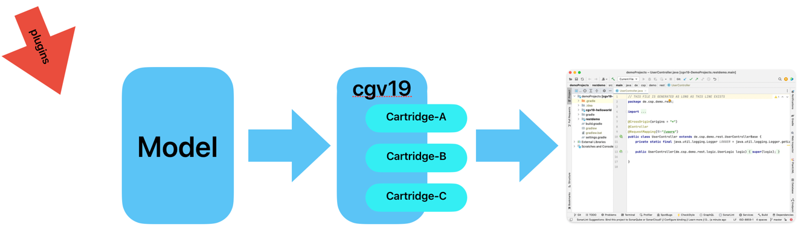

# Plugins. You are here

## Mankind is an eye focused animal.

A picture can say more than a 1.000 words. And that is especially 
true when it comes to structures.

This subproject provides a plugin for VisualParadigm. With the plugin
installed you can access the model inside VP on port 7001. The plugin
will send the model so that the cgv19-oom model loader can handle it.

In order to use this VisualParadigm plugin you will need:

* A copy of [Visual Paradigm (Community Edition is fine)](https://www.visual-paradigm.com/download/community.jsp)
* The plugin cgv19-vpplugin installed in that copy
* cgv19 with cgv19-oom cartridge plugged in
* VisualParadigm up and running with the model you are working on

You can than specify your model as "http://lcalhost:7001/ &lt;&lt;model-package&gt;&gt;"
in order to let cgv19 run on it.

For example, you can start VP and load the restDemo-model and then
start the stand-alone version of cgv19 with

cgv19 http://lcoalhost:7001/de.csp.demo.rest

## What will happen when Visual Paradigm is not running?

Well in that case the cgv19-oom cartridge will look for a file
&lt;&lt;model-package&gt;&gt;.oom. If it is found, the loader will load the model
from that file.

